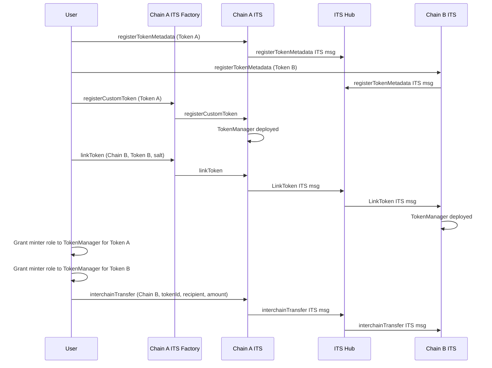

# ARC-1: ITS Hub Multi-Chain Token Linking

## Metadata

- **ARC ID**: 1
- **Author(s)**: Milap Sheth
- **Status**: Final
- **Created**: 2024-11-14
- **Last Updated**: 2025-02-14
- **Target Implementation**: Q1 2025
- **Deployment Status**: Live

## Summary

Extend the Interchain Token Service (ITS) Hub to support linking existing tokens across different chains, potentially using different decimals. This improvement enables token transfers for custom token links across both EVM and non-EVM chains by supporting appropriate decimal scaling.

## Motivation

### Background

The current EVM ITS implementation supports linking existing tokens across multiple chains with identical decimals, i.e. two existing ERC20 tokens can be linked together by sending a `DeployTokenManager` msg, and giving the token manager the minter role for the token. This allows the tokens to be transferred 1:1 across chains without the need for a wrapped intermediary token or swap.

To support linking tokens with other Amplifier chains via ITS Hub, ITS Hub needs to support linking tokens with different decimals. The existing `DeployTokenManager` msg type doesn't include enough information for ITS Hub to support this.

### Goals

- Enable linking of existing tokens across connected chains
- Support linking tokens with different decimal precisions

## Design

To allow ITS Hub to support linking tokens with different decimals, it needs to know the token decimals for both the source and destination chains.

To support this, two new ITS message types are introduced: `RegisterTokenMetadata` and `LinkToken`.

```solidity
struct RegisterTokenMetadata {
    bytes tokenAddress;
    uint8 decimals;
}

struct LinkToken {
    bytes32 tokenId;
    uint256 tokenManagerType;
    bytes sourceToken;
    bytes destinationToken;
    bytes params;
}
```

New entrypoints in the ITS Edge contract:

```solidity
function registerTokenMetadata(address token);

// Derives the tokenId for a linked token
function linkedTokenId(address deployer, bytes32 salt) external view returns (bytes32 tokenId);

// Registers an existing token on the source chain
function registerCustomToken(
    bytes32 salt,
    address tokenAddress,
    TokenManagerType tokenManagerType,
    address operator
) external payable returns (bytes32 tokenId);

// Links an existing registered token on the source chain to a token on the destination chain
function linkToken(
    bytes32 salt,
    string calldata destinationChain,
    bytes calldata destinationTokenAddress,
    TokenManagerType tokenManagerType,
    bytes calldata linkParams,
    uint256 gasValue
) external payable returns (bytes32 tokenId);
```

Flow:

Setup: The user controls token A and token B on two different chains.

1. User calls `registerTokenMetadata` on ITS Chain A to submit a `RegisterTokenMetadata` msg type to ITS Hub to register token data in ITS hub.
2. ITS Hub processes the `RegisterTokenMetadata` msg and stores the mapping of token address to decimals.
3. User does the same on ITS Chain B.
4. User calls `registerCustomToken` on ITS Chain A to register the token on the source chain. A token manager is deployed on the source chain corresponding to the `tokenId`.
5. User then calls `linkToken` on ITS Chain A with the destination token address for Chain B. This submits a `LinkToken` msg type to ITS Hub.
6. ITS Hub intercepts the `LinkToken` msg. It reads the decimals for each token address from it’s storage to calculate the scaling factor and creates the TokenInstance. If a token address isn’t registered in ITS Hub, it fails.
7. ITS Chain B receives the `LinkToken` msg. It deploys the corresponding token manager for the token to set it up.
8. ITS Hub can now receive `InterchainTransfer` msgs for this `tokenId`.



#### Alternative Solution: Enhanced DeployTokenManager msg

An alternative solution is to modify the existing `DeployTokenManager` msg type to include the source and destination token decimals. While this solution was not chosen, it is included for completeness.

```solidity
struct DeployTokenManager {
    bytes32 tokenId;
    uint256 tokenManagerType;
    bytes params;
    uint8 sourceDecimals;
    uint8 destinationDecimals;
}
```

ITS Hub can use the source and destination token decimals to determine the appropriate scaling factor to apply when intercepting this message. ITS edge contract can populate the source token decimals by reading the token metadata, however the destination token decimals will need to be provided by the deployer. This approach is easier to use for developers, since no additional metadata needs to be registered from each remote chain.

However, setting this incorrectly can be lead to the ITS hub recording the deployment incorrectly, while the deployment tx on the destination ITS will fail due to mismatching decimals, which isn’t recoverable. Since this is more error prone, this solution isn't recommended.

### References

- [InterchainTokenServiceTypes.sol](https://github.com/axelarnetwork/interchain-token-service/blob/main/contracts/types/InterchainTokenServiceTypes.sol)

### Changelog

| Date | Revision | Author | Description |
|------|-----------|---------|-------------|
| 2024-11-14 | v1.0 | Milap Sheth | Initial ARC draft |
| 2025-02-14 | v1.1 | Milap Sheth | Finalized ARC-1 |
