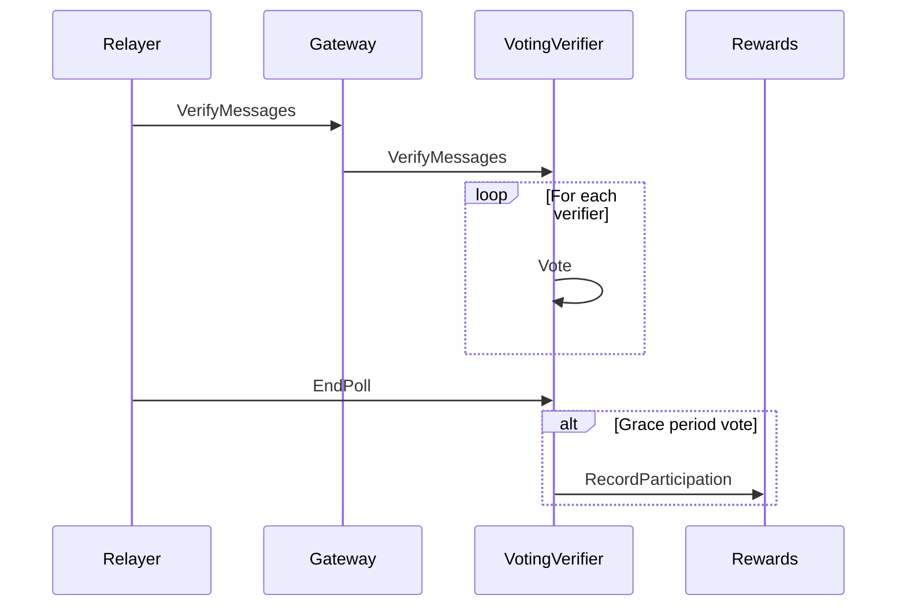

# ARC-12: Record participation batched variant in Rewards contract

## Metadata

- **ARC ID**: 12
- **Author(s)**: Ayush Tiwari
- **Category**: Amplifier Protocol
- **Status**: Draft
- **Created**: 2025‑10‑16
- **Last Updated**: 2025‑10‑17
- **Target Implementation**: Q4 2025

## Summary

The current system requires the Voting Verifier contract to call the Rewards contract once per verifier, incurring repeated sub‑message execution costs and increased gas usage. Each participation vote triggers its own contract invocation, which means the storage, context and serialization overheads are paid many times in a single poll. This proposal replaces those repeated calls with a single batched call that processes many participation records in one atomic transaction, reducing overhead and ensuring consistent state updates.

## Background and Motivation

In the existing flow, the Voting Verifier iterates over every participation event and calls the Rewards contract separately for each participant. Each of these calls:

- Triggers a full CosmWasm sub‑message execution (`submsg_execute`), incurring storage access, context setup/teardown, serialization and event emission costs.
- Is gas‑metered independently, so the per‑message execution cost is multiplied by the number of participants.

As the number of participants ( _N_ ) increases, the total gas usage grows roughly linearly with _N_, dominated by cross‑contract message costs. The repeated overhead wastes gas, increases operational cost for validators and users, and diminishes atomicity because partial failures can leave the system in an inconsistent state unless manually rolled back. A single batched call can eliminate redundant overhead and provide all‑or‑nothing semantics.

## Requirements

### Functional Requirements

#### Single‑Call Operation

The Voting Verifier must be able to submit all participation records for a given event in one `ExecuteMsg::RecordParticipationBatch` call. All participation records in a batch must be processed atomically — either all succeed, or the entire transaction reverts.

#### Backward Compatibility

- The existing `RecordParticipation` message (single record submission) must remain available for legacy contracts and off‑chain scripts.
- The batch function must internally reuse the same validation and reward‑calculation logic to guarantee consistent behaviour.

#### Data Validation

Each `ParticipationRecord` in the batch must be validated for:

- Non‑empty participant address.
- Matching `event_id` and `chain_name` with the current verifier context.
- Non‑zero weight or stake contribution.
- No duplicate participant entries within the same batch — duplicates **must** cause the batch to revert.

Invalid inputs must trigger a revert of the entire batch.

#### Consistent State Updates

Rewards distribution, event counters and validator effort metrics must be updated in a single, consistent state change. Intermediate partial updates must not persist in storage if any record fails validation.

## Design

### Old Function Signature

```rust
RecordParticipation {
    chain_name: ChainName,
    event_id: nonempty::String,
    verifier_address: String,
}
```

**Functionality:**

- Records a single verifier's participation for a specific event.
- The Voting Verifier must call this once per verifier, resulting in multiple WASM executions for multiple participants.
- Each call triggers storage reads/writes and emits events per verifier.
- Atomicity is per call; partial failures cannot be consolidated.



### New Function Signature

```rust
RecordParticipationBatch {
    chain_name: ChainName,
    event_id: nonempty::String,
    verifier_addresses: Vec<String>,
}
```

**Functionality Changes:**

- Allows recording multiple verifiers for the same event in a single call.
- The Voting Verifier collects verifier addresses and submits them once per event instead of looping over single calls.
- Internal batch processing in the Rewards contract:

  - Validate that the rewards pool exists for the given `chain_name` and `event_id`.
  - Check for duplicate verifier addresses; if any duplicates are detected, revert the entire call.
  - Validate each record (non‑empty address, correct event context, non‑zero weight) and update participation counts and other state fields atomically.

- The entire batch is processed atomically — either all succeed or the transaction reverts.
- Single‑record calls remain compatible and are internally routed through the same validation logic.

```mermaid
sequenceDiagram
    participant Relayer
    participant Gateway
    participant VotingVerifier
    participant Rewards
    Relayer ->> Gateway: VerifyMessages
    Gateway ->> VotingVerifier: VerifyMessages
    loop During poll
        VotingVerifier ->> VotingVerifier: Record each verifier's vote
    end
    Relayer ->> VotingVerifier: EndPoll
    Note over VotingVerifier: Build verifier_addresses[] for this (chain_name, event_id)
    VotingVerifier ->> Rewards: RecordParticipationBatch(chain_name, event_id, verifier_addresses[])
    activate Rewards
    Note over Rewards: Validate: non-empty addrs • unique addrs • correct context • non-zero weight
    alt All validations pass
        Rewards ->> Rewards: Update participation & state atomically
        Rewards -->> VotingVerifier: OK (batch recorded)
    else Any validation fails
        Rewards -->> VotingVerifier: ERROR (revert; no state changes)
    end
    deactivate Rewards
```

## References

- Rewards participation storage and APIs in the `rewards` contract: [https://github.com/axelarnetwork/axelar-amplifier/tree/main/contracts/rewards](https://github.com/axelarnetwork/axelar-amplifier/tree/main/contracts/rewards)
- Voting‑Verifier poll completion flow and current per‑verifier `RecordParticipation` messages: [https://github.com/axelarnetwork/axelar-amplifier/tree/main/contracts/voting-verifier](https://github.com/axelarnetwork/axelar-amplifier/tree/main/contracts/voting-verifier)

## Changelog

| Date       | Revision | Author       | Description   |
| ---------- | -------- | ------------ | ------------- |
| 2025‑10‑16 | v1.0     | Ayush Tiwari | Initial draft |
