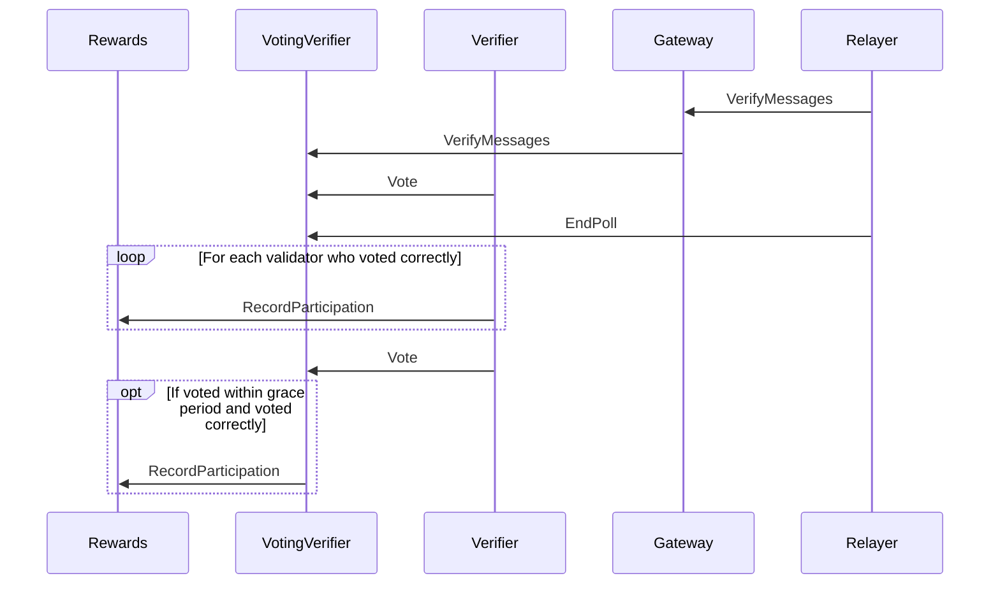
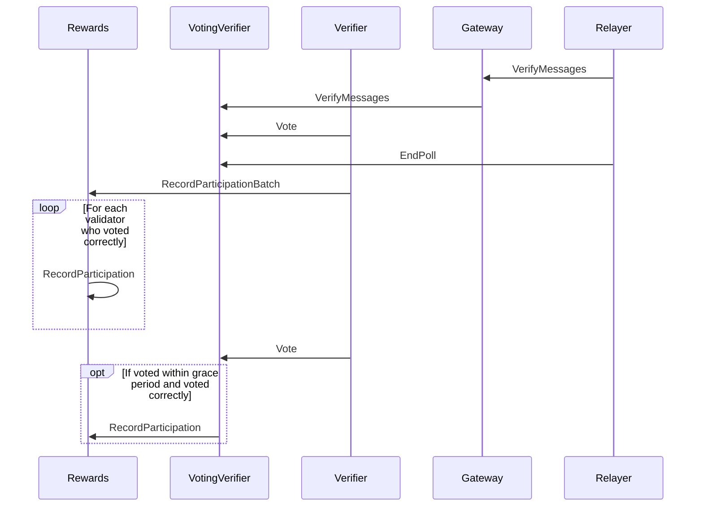

# ARC-12: Record participation batched variant

## Metadata

- **ARC ID**: 12
- **Author(s)**: Ayush Tiwari
- **Category**: Amplifier Protocol
- **Status**: Draft
- **Created**: 2025-10-16
- **Last Updated**: 2025-10-16
- **Target Implementation**: Q4 2025

## Summary

Current system has the Voting Verifier call the Rewards contract repeatedly — one call per participation vote. This causes multiple cross-contract calls inside a single larger operation, increasing gas and external call overhead. This proposal replaces repeated inter-contract calls with a single batched call that processes many participation records in one atomic transaction.

## Background and Motivation

In the current system, the Voting Verifier contract iterates over every participation event and calls the Rewards contract separately for each participant.
Each of these calls:

Triggers a full CosmWasm sub-message execution (submsg_execute), which incurs:
- Storage access overhead (SLOAD/SSTORE equivalents in CosmWasm),
- Context setup and teardown per call,
- Cross-contract serialization/deserialization of JSON/Binary payloads,
- Event emission costs per message.

Is individually gas-metered and billed in the Cosmos SDK runtime, meaning each call multiplies the per-message execution cost.

As the number of participants (N) increases, total gas grows roughly linearly with N, dominated by repeated cross-contract message costs — even when the logic per participation is trivial.

This structure causes:
- Wasted gas due to redundant contract entry overheads (deps, env, and message deserialization every time).
- Increased operational cost for validators and users submitting these votes.
- Reduced atomicity guarantees, since partial execution failure after a few successful sub-calls can lead to inconsistent recorded states (unless wrapped manually in rollback-safe logic).

## Requirements
### Functional Requirements

#### Single-Call Operation
The Voting Verifier must be able to submit all participation records for a given epoch in one ExecuteMsg::RecordParticipationBatch call.
All participation records in a batch must be processed atomically — either all succeed, or the entire transaction reverts.

#### Backward Compatibility
- The existing RecordParticipation message (single record submission) must remain available for legacy contracts and off-chain scripts.
- The batch function must internally reuse the same logic path to guarantee consistent validation and reward calculations.

#### Data Validation
- Each ParticipationRecord must be validated for:
- Non-empty participant address,
- Matching epoch ID with the current verifier context,
- Non-zero weight or stake contribution,
- No duplicate participant entries within the same batch.
- Invalid inputs must trigger a revert of the entire batch.

#### Consistent State Updates
- Rewards distribution, epoch counters, and validator effort metrics must be updated in a single, consistent state change.
- Intermediate partial updates must not persist in storage if any record fails validation.

## Design

### Old Function Signature
```rust
RecordParticipation {
    chain_name: ChainName,
    event_id: nonempty::String,
    verifier_address: String,
}
```

Functionality:
- Records a single verifier’s participation for a specific event.
- The Voting Verifier must call this once per verifier, resulting in multiple WASM executions for multiple participants.
- Each call triggers storage reads/writes and emits events per verifier.
- Atomicity is per call; partial failures cannot be consolidated.



### New Function Signature
```rust
RecordParticipationBatch {
    chain_name: ChainName,
    event_id: nonempty::String,
    verifier_addresses: Vec<String>,
}
```

Functionality Changes:
- Allows recording multiple verifiers for the same event in a single call.
- Voting Verifier collects verifier addresses and calls once per event instead of looping over single calls.
- Internal batch processing in the Rewards contract:
- Validate that the pool exists.
- Deduplicate verifier addresses within the batch.
- Update participation counts and relevant state for all verifiers.
- Entire batch is processed atomically — either all succeed or revert.
- Single-record calls remain compatible, internally routed to batch logic if desired.



## References

- Rewards participation storage and APIs in the `rewards` contract. https://github.com/axelarnetwork/axelar-amplifier/tree/main/contracts/rewards
- Voting-Verifier poll completion flow and current per-verifier `RecordParticipation` messages. https://github.com/axelarnetwork/axelar-amplifier/tree/main/contracts/voting-verifier

## Changelog

|  Date       | Revision | Author       | Description   |
|-------------|----------|--------------|---------------|
| 2025-10-16  | v1.0     | Ayush Tiwari | Initial draft |
