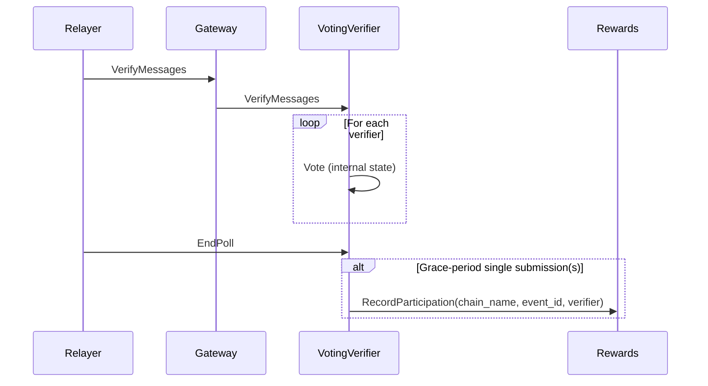
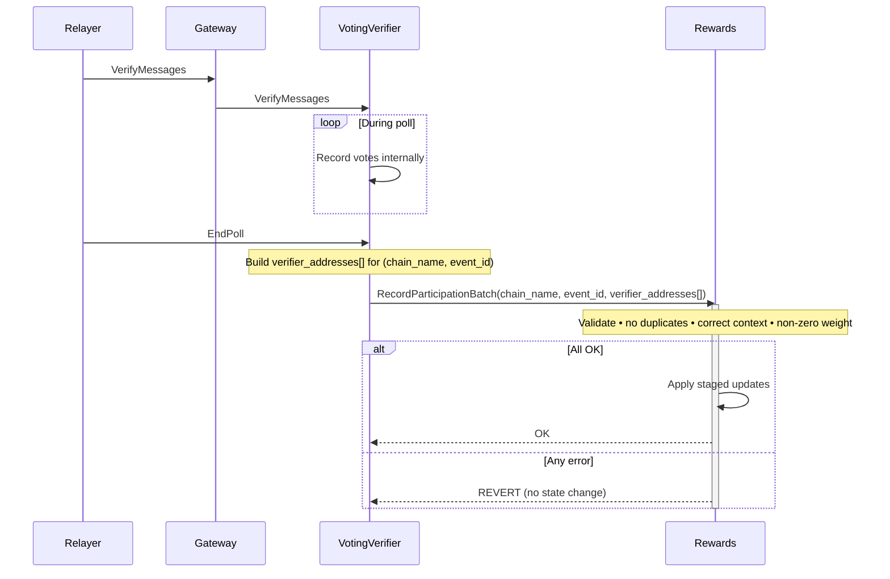

# ARC-12: Record participation batched variant in Rewards contract

## Metadata

- **ARC ID**: 12
- **Author(s)**: Ayush Tiwari
- **Category**: Amplifier Protocol
- **Status**: Draft
- **Created**: 2025-10-16
- **Last Updated**: 2025-10-23
- **Target Implementation**: Q4 2025

## Summary

The current system requires the Voting Verifier contract to call the Rewards contract once **per verifier**, incurring repeated sub-message execution costs and higher gas. This ARC replaces those repeated calls with **one batched call** that processes many participation records, reducing unnecessary read/writes.

## Background and Motivation

In the existing flow, the Voting Verifier iterates over every participation event and calls the Rewards contract separately for each participant. Each call:

- Triggers a full CosmWasm sub-message execution (serialization, context init/teardown, storage I/O).
- Is metered independently, so cost scales with the number of verifiers.

A single batched call removes redundant overhead.

## Requirements

### Functional

- The Voting Verifier must be able to submit all participation records for a given **(chain_name, event_id)** in a single `RecordParticipationBatch` call.
- The legacy `RecordParticipation` (single submission) remains available and uses the same internal validation logic.

### Validation

Each record must validate:

- Non-empty `verifier_address`.
- Correct context: `chain_name` and `event_id` match the batch.
- Non-zero weight/participation contribution.
- **No duplicate** `verifier_address` entries within the same batch.
  - If duplicates exist **after** upstream deduplication, the entire batch **reverts**.

### Consistent State Updates

All counters, participation maps, and derived metrics are updated **in one state transition**. No intermediate partial writes are permitted.

## Design

### Old (single-record) function

```rust
RecordParticipation {
    chain_name: ChainName,
    event_id: nonempty::String,
    verifier_address: String,
}
```

**Behavior**

- Called once per verifier during/after poll.
- Gas scales linearly with the number of verifiers.



### New (batched) function

```rust
RecordParticipationBatch {
    chain_name: ChainName,
    event_id: nonempty::String,
    verifier_addresses: Vec<String>,
}
```

**Behavior changes**

- Voting Verifier aggregates `verifier_addresses` and performs a **single** call per `(chain_name, event_id)`.
- Rewards validates input and writes participation after processing, reducing the redundant write calls significantly.

**Batch processing (Rewards) pseudocode**

```text
assert batch.chain_name == ctx.chain_name
assert batch.event_id   == ctx.event_id
assert verifier_addresses.len() > 0

if has_duplicates(verifier_addresses):
    revert("duplicate verifier addr in batch")

for addr in verifier_addresses:
    require_non_empty(addr)
    require_positive_weight(addr, ctx)
    stage_update(ctx.participation[addr] += 1)

commit_staged_updates()
```



## References

- Rewards participation storage and APIs in the `rewards` contract: [https://github.com/axelarnetwork/axelar-amplifier/tree/main/contracts/rewards](https://github.com/axelarnetwork/axelar-amplifier/tree/main/contracts/rewards)
- Voting‑Verifier poll completion flow and current per‑verifier `RecordParticipation` messages: [https://github.com/axelarnetwork/axelar-amplifier/tree/main/contracts/voting-verifier](https://github.com/axelarnetwork/axelar-amplifier/tree/main/contracts/voting-verifier)

## Changelog

| Date       | Revision | Author       | Description   |
| ---------- | -------- | ------------ | ------------- |
| 2025‑10‑16 | v1.0     | Ayush Tiwari | Initial draft |
