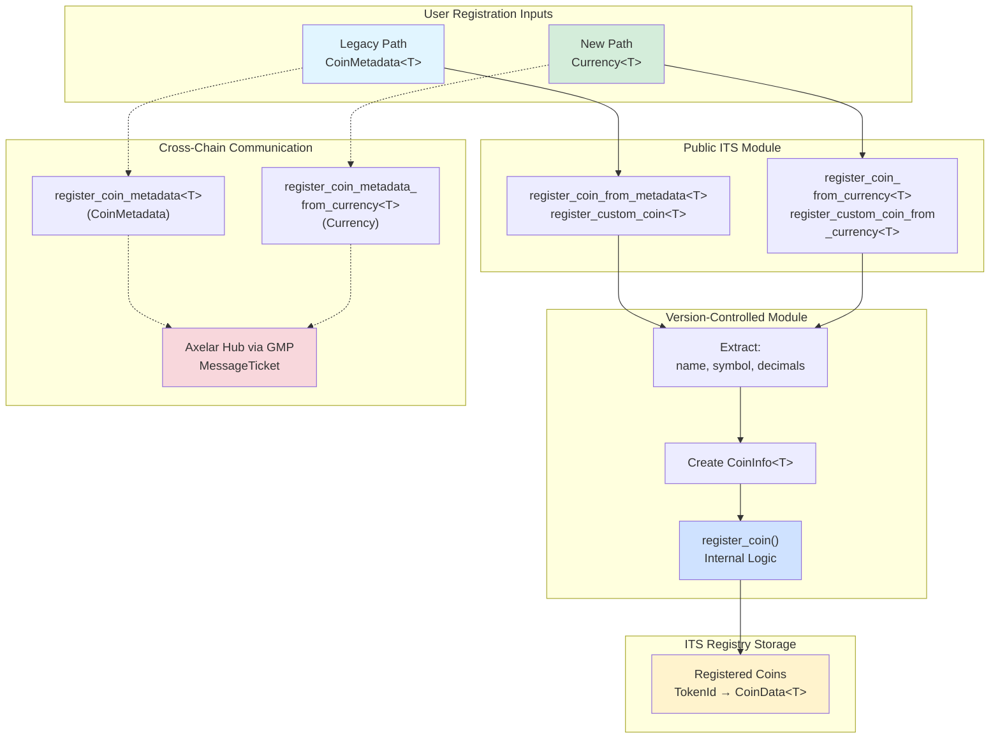

# ARC-16: Sui ITS Currency Standard Migration

## Metadata

- **ARC ID**: 16
- **Author(s)**: Drew Taylor
- **Category**: Interchain Token Protocol
- **Status**: Draft
- **Created**: 2025-10-22
- **Last Updated**: 2025-10-22
- **Target Implementation**: Q4 2025

## Summary

This ARC proposes migrating the Axelar Interchain Token Service (ITS) on Sui from the legacy `CoinMetadata<T>` standard to the new `Currency<T>` standard introduced by Sui's coin registry system. The migration maintains full backward compatibility with all existing registered tokens while enabling new registrations to leverage enhanced features provided by Sui's unified currency management system, including improved metadata management, enhanced supply tracking, and better integration with the Sui ecosystem.

## Background and Motivation

Sui recently introduced the Currency Standard through the `sui::coin_registry` module, which provides unified metadata management, enhanced supply tracking, and improved regulatory features compared to the legacy Coin standard. The new standard represents Sui's strategic direction for fungible token management, offering better integration with wallets, exchanges, and DeFi protocols across the ecosystem.

The Interchain Token Service currently uses the legacy `CoinMetadata<T>` standard for token registration and management. This affects five core modules within the Axelar CGP Sui repository:

- Core bridge contract (`interchain_token_service.move`)
- Version-controlled implementation (`interchain_token_service_v0.move`)
- Example implementation (`example/sources/its/its.move`)
- Token contract (`interchain_token/sources/interchain_token.move`)
- Data structures (`types/unregistered_coin_data.move`)

The Interchain Token Service should migrate to the Currency Standard for several reasons:

1. **Ecosystem Alignment**: The Sui ecosystem is standardizing on the Currency Standard for all new token implementations. Remaining on the legacy standard risks compatibility issues with new protocols and infrastructure.
2. **Enhanced Features**: The Currency Standard provides improved metadata management through the `Currency<T>` type and `MetadataCap<T>`, enabling more flexible governance and regulatory compliance options.
3. **Future-Proofing**: As Sui continues developing its framework, support for legacy patterns may diminish. Early adoption positions ITS favorably within the ecosystem.

## Requirements

### Functional Requirements

1. **Backward Compatibility**: All coins registered with ITS prior to the upgrade must continue to function without any code changes, re-registration, or user intervention.
2. **Dual-Path Registration**: Support both registration paths simultaneously:
   - Legacy path using `CoinMetadata<T>` via existing functions
   - New path using `Currency<T>` and `MetadataCap<T>` via new functions
3. **Open-Loop Token Support**: Focus migration efforts on open-loop fungible tokens represented by `Currency<T>`. Closed-loop tokens (`Token<T>`) are out of scope.
4. **Storage Compatibility**: Maintain both `UnregisteredCoinData<T>` and `UnregisteredCoinDataV2<T>` types to allow coexistence of legacy and new-standard coins.
5. **Migration Support**: Provide administrative functions to migrate legacy coins from `CoinMetadata<T>` to `Currency<T>`, enabling eventual deprecation of the legacy standard in future versions.

### Technical Requirements

1. **Module Updates**: Add new function variants that accept `Currency<T>` and `MetadataCap<T>` parameters across affected modules while preserving all existing function signatures.
2. **Metadata Extraction**: Extract token metadata (name, symbol, decimals) directly from `Currency<T>` using built-in accessor methods.
3. **Type System Extensions**: Create `UnregisteredCoinDataV2<T>` type to store `Currency<T>` objects alongside legacy types.

## Design

The migration introduces parallel function paths rather than replacing existing ones, ensuring zero disruption to currently registered tokens while enabling new registrations to use the Currency Standard. All new functions are additions, not replacements, and legacy code paths remain untouched and fully supported.



### Module Changes

#### 1. Example Contract Updates (`example/sources/its/its.move`)

The example contract will be redeployed (not upgraded) so its function signatures can be changed.

**Function Signature Changes:**

```move
public fun register_coin<TOKEN>(
    its: &mut InterchainTokenService, 
    currency: &Currency<TOKEN>,
)

public fun register_coin_with_cap<TOKEN>(
    its: &mut InterchainTokenService,
    currency: &Currency<TOKEN>,
    metadata_cap: MetadataCap<TOKEN>,
    treasury_cap: TreasuryCap<TOKEN>,
)
```

**Key Changes:**
- Replace `CoinMetadata<TOKEN>` parameter with `Currency<TOKEN>`
- Add `MetadataCap<TOKEN>` parameter to registration functions that involve token administration

#### 2. InterchainToken Module Rewrite (`interchain_token/sources/interchain_token.move`)

The InterchainToken module will be rewritten to utilize the new `coin_registry` module for token creation.

**New Implementation Pattern:**

```move
module interchain_token::q {
    use sui::coin_registry;

    public struct Q has drop {}

    fun init(witness: Q, ctx: &mut TxContext) {
        let (builder, treasury_cap) = coin_registry::new_currency_with_otw(
            witness,
            9,                                      // decimals
            b"Q".to_string(),                       // symbol
            b"Quote".to_string(),                   // name
            b"".to_string(),                        // description
            b"".to_string(),                        // icon URL
            ctx,
        );

        let metadata_cap = builder.finalize(ctx);

        transfer::public_transfer(treasury_cap, ctx.sender());
        transfer::public_transfer(metadata_cap, ctx.sender());
    }
}
```

**Key Changes:**
- Replace `coin::create_currency` with `coin_registry::new_currency_with_otw`
- Use the builder pattern provided by the coin registry
- Call `finalize()` on the builder to obtain `MetadataCap<T>`
- Transfer both `TreasuryCap<T>` and `MetadataCap<T>` to the sender

#### 3. InterchainTokenService Core Module Updates (`interchain_token_service.move`)

Add new public entry points that delegate to the version-controlled implementation:

```move
public fun register_coin_from_currency<T>(...)
public fun register_custom_coin_from_currency<T>(...)
public fun register_coin_metadata_from_currency<T>(...)
public fun give_unregistered_currency_coin<T>(...)
public fun give_unlinked_currency_coin<T>(...)
public fun remove_unregistered_currency_coin<T>(...)
```

Each function delegates to its corresponding implementation in `interchain_token_service_v0`.

#### 4. InterchainTokenService Implementation Updates (`interchain_token_service_v0.move`)

This module requires the most extensive changes with eight new functions.

**4.1 `register_coin_from_currency<T>`**

Creates a `CoinInfo` structure from `Currency<T>` metadata and registers the coin:

```move
public(package) fun register_coin_from_currency<T>(
    self: &mut InterchainTokenService_v0,
    currency: &Currency<T>,
    coin_management: CoinManagement<T>,
): TokenId {
    let coin_info = coin_info::from_info<T>(
        currency.name(), 
        currency.symbol(), 
        currency.decimals()
    );
    self.register_coin(coin_info, coin_management, true)
}
```

**4.2 `register_custom_coin_from_currency<T>`**

Registers a custom token with a deployer-specified salt:

```move
public(package) fun register_custom_coin_from_currency<T>(
    self: &mut InterchainTokenService_v0,
    deployer: &Channel,
    salt: Bytes32,
    currency: &Currency<T>,
    coin_management: CoinManagement<T>,
    ctx: &mut TxContext,
): (TokenId, Option<TreasuryCapReclaimer<T>>) {
    let token_id = token_id::custom_token_id(
        &self.chain_name_hash, 
        deployer, 
        &salt
    );
    let coin_info = coin_info::from_info(
        currency.name(), 
        currency.symbol(), 
        currency.decimals()
    );
    // Remaining logic mirrors register_custom_coin...
}
```

**4.3 `register_coin_metadata_from_currency<T>`**

Generates a message ticket for cross-chain metadata registration:

```move
public(package) fun register_coin_metadata_from_currency<T>(
    self: &InterchainTokenService_v0, 
    currency: &Currency<T>,
): MessageTicket {
    let decimals = currency.decimals();
    // ibid. register_coin_metadata...
}
```

**4.4 `add_unlinked_currency_coin<T>` (Internal Helper)**

Private helper function for adding unlinked coins:

```move
fun add_unlinked_currency_coin<T>(
    self: &mut InterchainTokenService_v0,
    token_id: UnlinkedTokenId,
    currency: &Currency<T>,
    treasury_cap: Option<TreasuryCap<T>>,
    ctx: &mut TxContext,
): Option<Channel> {
    let coin_info = coin_info::from_info<T>(
        currency.name(), 
        currency.symbol(), 
        currency.decimals()
    );
    // ibid. add_unlinked_coin...
}
```

**4.5 `give_unlinked_currency_coin<T>`**

Public function to register an unlinked coin:

```move
public(package) fun give_unlinked_currency_coin<T>(
    self: &mut InterchainTokenService_v0,
    token_id: TokenId,
    currency: &Currency<T>,
    treasury_cap: Option<TreasuryCap<T>>,
    ctx: &mut TxContext,
): (Option<TreasuryCapReclaimer<T>>, Option<Channel>) {
    // ibid. give_unlinked_coin...

    let distributor = self.add_unlinked_currency_coin(
        unlinked_token_id, 
        currency, 
        treasury_cap, 
        ctx
    );

    // ibid. give_unlinked_coin...
}
```

**4.6 `add_unregistered_currency_coin<T>` (Internal Helper)**

Private helper to add unregistered currency coins to internal storage:

```move
fun add_unregistered_currency_coin<T>(
    self: &mut InterchainTokenService_v0,
    token_id: UnregisteredTokenId,
    treasury_cap: TreasuryCap<T>,
    currency: Currency<T>,
) {
    self.unregistered_coins.add(
        token_id, 
        unregistered_coin_data_v2::new(treasury_cap, currency)
    );

    // ibid. add_unregistered_coin...
}
```

**4.7 `give_unregistered_currency_coin<T>`**

Transfers an unregistered currency coin to the ITS contract:

```move
public(package) fun give_unregistered_currency_coin<T>(
    self: &mut InterchainTokenService_v0,
    currency: &mut Currency<T>,
    treasury_cap: TreasuryCap<T>,
    metadata_cap: MetadataCap<T>,
) {
    assert!(treasury_cap.total_supply() == 0, ENonZeroTotalSupply);
    assert!(currency.icon_url().length() == 0, EUnregisteredCoinHasUrl);
    
    let decimals = currency.decimals();
    let symbol = currency.symbol();
    
    // Clear description and consume MetadataCap
    currency.set_description(&metadata_cap, string::utf8(b""));
    currency.delete_metadata_cap(metadata_cap);
    
    // ibid. give_unregistered_coin...
    
    self.add_unregistered_currency_coin<T>(token_id, treasury_cap, currency);
    
    // ibid. give_unregistered_coin...
}
```

**4.8 `remove_unregistered_currency_coin<T>`**

Removes an unregistered currency coin from ITS storage:

```move
fun remove_unregistered_currency_coin<T>(
    self: &mut InterchainTokenService_v0,
    token_id: UnregisteredTokenId,
): (TreasuryCap<T>, Currency<T>) {
    let unregistered_coin: UnregisteredCoinDataV2<T> = self.unregistered_coins.remove(token_id);

    let (treasury_cap, currency) = unregistered_coin.destroy();

    remove_unregistered_coin_type(self, token_id);

    (treasury_cap, currency)
}
```

#### 5. Supporting Type Changes (`types/unregistered_coin_data.move`)

Create a new version of the `UnregisteredCoinData` type:

```move
public struct UnregisteredCoinDataV2<phantom T> has store {
    treasury_cap: TreasuryCap<T>,
    currency: Currency<T>,
}

public fun new<T>(
    treasury_cap: TreasuryCap<T>,
    currency: Currency<T>,
): UnregisteredCoinDataV2<T> {
    UnregisteredCoinDataV2 { treasury_cap, currency }
}

public fun destroy<T>(
    self: UnregisteredCoinDataV2<T>
): (TreasuryCap<T>, Currency<T>) {
    let UnregisteredCoinDataV2 { treasury_cap, currency } = self;
    (treasury_cap, currency)
}
```

**Rationale:**
- Version suffix (`V2`) distinguishes from legacy `UnregisteredCoinData`
- Enables gradual migration without breaking existing functionality
- Provides type-safe accessor and destructor methods

#### 6. Migration Function Implementation

Provide administrative functions to migrate legacy coins from `CoinMetadata<T>` to `Currency<T>`:

```move
public fun migrate_coin_to_currency<T>(
    self: &mut InterchainTokenService_v0,
    token_id: TokenId,
    operator_cap: &OperatorCap,
)
```

**Migration Requirements:**
- Verify token is currently registered with `CoinMetadata<T>`
- Ensure metadata consistency between old and new standards
- Validate admin authorization through capability checking
- Prevent double-migration attempts

## References

- Sui Currency Standard documentation: https://docs.sui.io/standards/currency
- Sui `coin_registry` module: https://mystenlabs.github.io/sui/sui_types/coin_registry/
- Axelar CGP Sui repository: https://github.com/axelarnetwork/axelar-cgp-sui

## Changelog

| Date | Revision | Author | Description |
|------|----------|--------|-------------|
| 2025-10-23 | v1.0 | Drew Taylor | Initial draft |
