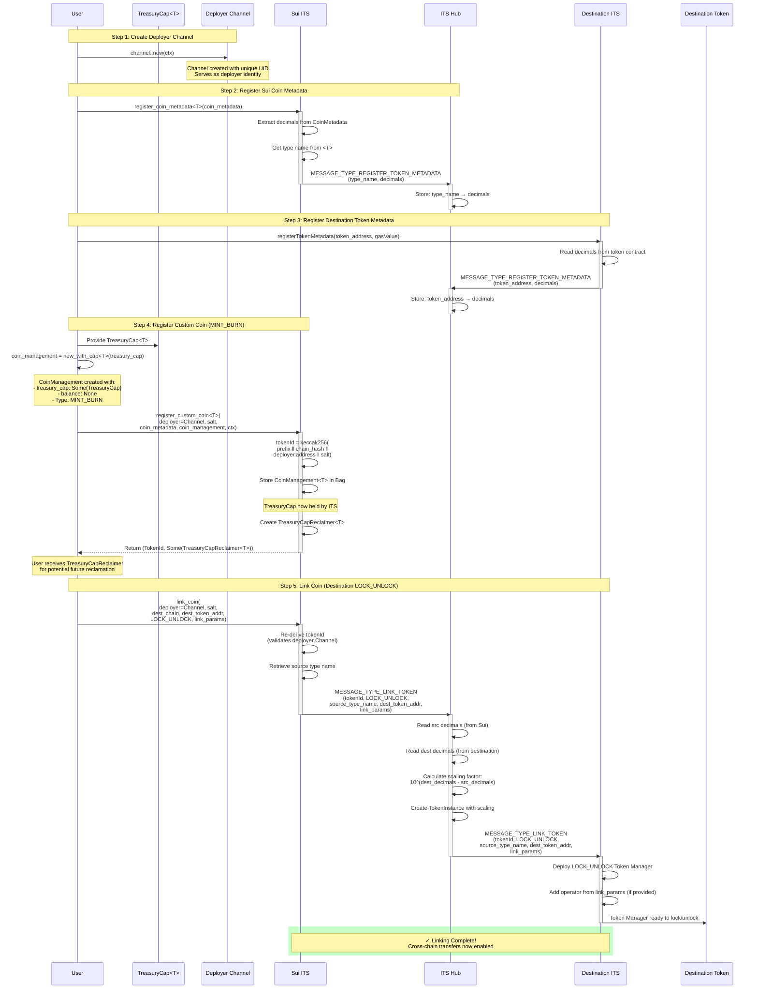

# ARC-17: Sui Custom Token Linking

## Metadata

- **ARC ID**: 17
- **Author(s)**: Drew Taylor
- **Category**: Interchain Token Protocol
- **Status**: Final
- **Created**: 2025-11-03
- **Last Updated**: 2025-11-04
- **Deployment Status**: Live

## Summary

This ARC specifies the implementation of custom token linking for Sui in the Interchain Token Service (ITS). Custom token linking enables existing Sui coins to be linked with tokens on other chains while supporting different decimal precisions through ITS Hub's automatic scaling. This specification details the Sui-specific patterns, `Channel`-based identity model, `CoinManagement` token manager structure, and key architectural differences from EVM implementations.

## Background and Motivation

ITS supports two distinct token deployment approaches:

**Native Interchain Tokens**: Tokens deployed directly by ITS using standardized contracts. They must have identical decimals across all chains, and linking uses a **deploy origin** → **deploy remote** workflow. Metadata registration is not required, since decimals are the same on both the origin and destination chains.

**Custom Tokens**: Tokens deployed independently that integrate with ITS through registration and linking. They support different decimal precisions across chains via ITS Hub's automatic scaling. Linking requires metadata registration on each chain, followed by registration in ITS, then explicit linking. Custom tokens cannot use the `NATIVE_INTERCHAIN_TOKEN` token manager type.

The ability to link tokens with different decimals is crucial for integrating existing token ecosystems. For example, USDC has 6 decimals on some chains (e.g. Ethereum, Solana, etc.) but 18 on others (e.g. BNB Chain). When linking tokens with different decimal precisions, ITS Hub automatically scales the decimals ensuring correct token transfer amounts while preserving each chain's native precision.

### Motivation for Sui-Specific Token Linking ARC

Sui's implementation differs fundamentally from EVM (and other) chains in several areas:

1. **Channel-Based Identity**: Uses `Channel` objects instead of addresses for deployer identity
2. **Type Names for Token Addresses**: Sui coins are identified by their full type name, using the format `package::module::SYMBOL` (example: `0b6345a938be0a9bcd8319ca6b768bfddfffd60f0178d920973a528ef741c639::test::TEST`), rather than by contract address
3. **CoinManagement Struct**: Replaces token manager contracts
4. **Object-Based Capabilities**: `TreasuryCap` objects replace role-based minter permissions
5. **Chain-Aware Token IDs**: Token ID derivation includes a chain name hash

### Goals

This ARC aims to:

1. Specify Sui's custom token linking implementation within the ITS framework
3. Clarify key differences from EVM token manager contracts
4. Provide guidance for developers integrating Sui tokens with ITS

## Requirements

### Technical Requirements

1. **Channel Identity**: Use `Channel` objects for deployer identity and authentication throughout the linking process
2. **Type Safety**: Utilize Sui's generic type system (`<T>`) for compile-time token type validation
3. **Token ID Derivation**: Include chain name hash in custom token ID calculation: `keccak256(prefix || chain_hash || deployer || salt)`
4. **CoinManagement**: Implement token manager logic within the `CoinManagement` package supporting both `LOCK_UNLOCK` and `MINT_BURN` token management
5. **Treasury Cap Management**: Support transfer and reclaim `TreasuryCap` workflow for `MINT_BURN` token managers
6. **Message Format Compatibility**: Use ABI encoding compatible with EVM ITS implementations
7. **Salt Format**: Enforce 32-byte salt format matching Sui address format
8. **Salt Uniqueness**: Prevent reuse of same salt with same deployer `Channel`

### Security Requirements

1. **Channel Ownership Validation**: Verify `Channel` ownership during linking to ensure deployer authentication
2. **Token Manager Type Validation**: Prevent use of `NATIVE_INTERCHAIN_TOKEN` type for custom tokens
3. **Same-Chain Prevention**: Block linking tokens to the source chain itself
4. **Operator & Distributor Authorization**: Validate `Channel`-based operator and distributor permissions for administrative operations
5. **Treasury Cap Reclamation**: Enable original deployer to reclaim `TreasuryCap` if needed using `TreasuryCapReclaimer`
6. **Flow Limit Enforcement**: Support flow limits with operator-only modification rights

## Design

### Process Flow Overview

Sui custom token linking uses the following workflow:

```
1. User registers coin metadata on Sui via register_coin_metadata<T>
   → Sends token type name and decimals to ITS Hub
   
2. User registers coin metadata on destination chain
   → ITS Hub stores decimal mappings for both chains

3. User calls register_custom_coin<T> on Sui
   → Creates CoinManagement<T> (token manager)
   → Claims tokenId for deployer Channel + salt
   → Returns TokenId and optional TreasuryCapReclaimer<T>

4. User calls link_coin with the destination token address
   → Sends LINK_TOKEN message to ITS Hub
   → ITS Hub calculates scaling factor from stored decimals
   
5. Destination chain receives LINK_TOKEN message
   → Deploys corresponding token manager
   
6. ITS Hub now processes InterchainTransfer messages with automatic decimal scaling
```

### Channel-Based Identity Model

Sui uses `Channel` objects for authenticating rather than transaction sender addresses. A `Channel` is a Sui object with a unique UID that represents identity (much like an address) across ITS operations:

```move
public struct Channel has key, store {
    id: UID,
}
```

Since `Channel` is an object the can be owned by any user or contract, transferring a `Channel` object to another party transfers all of its capabilities and permissions (including operatorship, and distributorship).

For convenience, `Channel`s can be converted to an address format using the `to_address` helper function:

```move
public fun to_address(self: &Channel): address {
    object::id_address(self)
}
```

**Usage in Token Linking:**

The same `Channel` must be used for both `register_custom_coin` and `link_coin` transactions. This proves the coin deployer's identity since the token ID is derived, in both cases, from the `Channel` and user provided `salt`, and the derived token ID must already exist (e.g. match the token ID from `register_custom_coin`) for token linking to succeed.

### Token Address Encoding

#### Type Names vs Contract Addresses

Sui identifies coins by their **full type name** rather than contract addresses. This fundamental difference stems from Move's type system, where each coin is defined as a generic type parameter `<T>` rather than a deployed contract instance.

**EVM Token Address Format:**
```
0x1234567890abcdef1234567890abcdef12345678  // 20-byte hex address
```

**Sui Token Type Name Format:**
```
0x6345a938be0a9bcd8319ca6b768bfddfffd60f0178d920973a528ef741c639::test::TEST // type name (package_id::module_name::TYPE)
```

The Sui format consists of three components separated by `::`:
1. **Package ID**: The hex address where the coin's package is deployed
2. **Module Name**: The Move module containing the coin definition
3. **Type Name**: The coin's type identifier (typically the coin symbol)

This type-based identification is intrinsic to Move's design—coins aren't separate contract instances but rather instances of a generic `Coin<T>` type where `T` is the specific coin type.

#### The Role of `registered_coin_type`

When custom coins are registered with Sui ITS, a mapping is stored between `TokenId` and `TypeName`:

```move
public struct InterchainTokenService_v0 has store {
    registered_coin_types: Table<TokenId, TypeName>,  // TokenId → TypeName mapping
    registered_coins: Bag,                            // TokenId → CoinManagement<T>
    // ... other fields
}
```

The `registered_coin_type` function retrieves the stored type name for a given token ID:

```move
public fun registered_coin_type(self: &InterchainTokenService, token_id: TokenId): &TypeName {
    assert!(self.registered_coin_types.contains(token_id), EUnregisteredCoin);
    &self.registered_coin_types[token_id]
}
```

This mapping is critical because:
1. **Type Safety**: Ensures the correct coin (`<T>` parameter) is used in subsequent operations
2. **Cross-Chain Compatibility**: Provides the token identifier needed for ITS Hub and other chains
3. **Validation**: Verifies the token exists and is properly registered before linking

#### Converting Type Names for ABI Encoding

When constructing ITS messages, token addresses must be encoded as bytes for transmission. EVM token addresses are already in hexadecimal format and can be directly encoded. However, Sui type names contain non-hexadecimal characters (e.g. `::`), requiring conversion.

**Encoding Process:**

In the `link_coin` function, the source token type name is converted to bytes:

```move
// Retrieve the registered type name
let source_token_address = (*self.registered_coin_type(token_id)).into_string().into_bytes();

// Encode in the LINK_TOKEN message
writer
    .write_u256(MESSAGE_TYPE_LINK_TOKEN)
    .write_u256(token_id.to_u256())
    .write_u256(token_manager_type.to_u256())
    .write_bytes(source_token_address)  // Type name as bytes
    .write_bytes(destination_token_address)
    .write_bytes(link_params);
```

The conversion chain is:
1. `TypeName` → `String` via `.into_string()`
2. `String` → `vector<u8>` via `.into_bytes()`
3. Bytes written to ABI-encoded payload

#### Cross-Chain Encoding Differences

**Key Differences:**

| Chain Type | Token Address Format | Encoding Method |
|------------|---------------------|-----------------|
| EVM | 20-byte hex address | Direct hex (already in proper format) |
| Sui | Type name string with `::` | ASCII bytes (UTF-8 encoding of string) |
| Stellar | Account/Contract address | ASCII bytes |
| Solana (SVM) | Base58 address | Decoded to 32-byte hex |

### CoinManagement: Sui's Token Manager

In EVM, each token gets a separate `TokenManager` contract that handles locking/unlocking or minting/burning. Sui replaces this with the `CoinManagement` package—a generic structure stored within ITS that manages individual token operations.
```move
public struct CoinManagement<phantom T> has store {
    treasury_cap: Option<TreasuryCap<T>>,// For MINT_BURN
    balance: Option<Balance<T>>, // For LOCK_UNLOCK
    distributor: Option<address>, // Minting/burning authority
    operator: Option<address>, // Administrative authority
    flow_limit: FlowLimit, // Rate limiting
    dust: u256, // Rounding dust tracking
}
```

#### Key Architectural Differences

| Aspect | EVM TokenManager | Sui CoinManagement |
|--------|------------------|-------------------|
| **Deployment** | Separate contract per token | Stored in ITS Bag collection |
| **Type Safety** | Runtime via address lookup | Compile-time via generic `<T>` |
| **Authority Model** | Role-based (operator, minter) | Object-based (`TreasuryCap`, `Channel` addresses) |
| **Minting & Burning** | Calls token.mint(), token.burn() with minter role | Directly mints and burns via `TreasuryCap` |
| **Locking** | Transfers tokens to/from contract | Joins/splits Balance<T> |

#### CoinManagement Variants

**LOCK_UNLOCK Type:**
```move
public fun new_locked<T>(): CoinManagement<T> {
    CoinManagement<T> {
        treasury_cap: option::none(),
        balance: option::some(balance::zero()),
        distributor: option::none(),
        operator: option::none(),
        flow_limit: flow_limit::new(),
        dust: 0,
    }
}
```

- Stores `Balance<T>` for holding locked tokens
- No `TreasuryCap` needed
- Coins are locked by [joining](https://docs.sui.io/references/framework/sui_sui/coin#sui_coin_join) to balance, unlocked by [splitting](https://docs.sui.io/references/framework/sui_sui/coin#sui_coin_split) from balance

**MINT_BURN Type:**
```move
public fun new_with_cap<T>(treasury_cap: TreasuryCap<T>): CoinManagement<T> {
    CoinManagement<T> {
        treasury_cap: option::some(treasury_cap),
        balance: option::none(),
        distributor: option::none(),
        operator: option::none(),
        flow_limit: flow_limit::new(),
        dust: 0,
    }
}
```

- Stores `TreasuryCap<T>` for minting/burning
- No balance storage needed
- Tokens are burned by decreasing supply, minted by increasing supply

#### `CoinManagement` Core Operations

**Taking Tokens (Outbound Transfer):**
```move
public(package) fun take_balance<T>(
    self: &mut CoinManagement<T>, 
    to_take: Balance<T>, 
    clock: &Clock
): u64 {
    self.flow_limit.add_flow_out(to_take.value(), clock);
    let amount = to_take.value();
    if (self.has_treasury_cap()) {
        self.burn(to_take);  // MINT_BURN: burn tokens
    } else {
        self.balance.borrow_mut().join(to_take);  // LOCK_UNLOCK: lock tokens
    };
    amount
}
```

**Giving Tokens (Inbound Transfer):**
```move
public(package) fun give_coin<T>(
    self: &mut CoinManagement<T>, 
    amount: u64, 
    clock: &Clock, 
    ctx: &mut TxContext
): Coin<T> {
    self.flow_limit.add_flow_in(amount, clock);
    if (self.has_treasury_cap()) {
        self.mint(amount, ctx)  // MINT_BURN: mint new tokens
    } else {
        coin::take(self.balance.borrow_mut(), amount, ctx)  // LOCK_UNLOCK: unlock tokens
    }
}
```

**Flow Limit Management:**
```move
public(package) fun set_flow_limit<T>(
    self: &mut CoinManagement<T>, 
    channel: &Channel, 
    flow_limit: Option<u64>
) {
    assert!(self.operator.contains(&channel.to_address()), ENotOperator);
    self.set_flow_limit_internal(flow_limit);
}
```

Only the assigned operator `Channel` can modify flow limits, providing security against unauthorized rate limit changes.

### Supported Token Managers

Unlike EVM and other chains, Sui only supports two token manager types for custom tokens:

#### LOCK_UNLOCK (`2`)

Tokens are locked on source chain and unlocked from pre-existing supply on destination chain. Use this manager type for coins that meet the following criteria:
- Existing tokens with established supply distribution
- No minting authority available or desired
- Simple integration without authority transfer

To use this manager type, create a `CoinManagement` using the `new_locked<T>()` function.

#### MINT_BURN (`4`)

Tokens are burned on source chain and minted on destination chain. Use this manager type for coins that meet the following criteria:
- Dynamic supply management desired
- New tokens being deployed cross-chain
- Lock/unlock liquidity insufficient

To use this manager type. create a `CoinManagement` using the `new_with_cap<T>(treasury_cap)` function.

**`MINT_BURN` Requirements:**
- Deployer must provide `TreasuryCap<T>` and transfer it to ITS
- Returns `TreasuryCapReclaimer<T>` for reclaiming the `TreasuryCap`

### Complete Process Flow



## References

- [ARC-1](./ARC-1.md)
- [Sui Interchain Token Service](https://github.com/axelarnetwork/axelar-cgp-sui)
- [EVM Interchain Token Service](https://github.com/axelarnetwork/interchain-token-service)
- [Sui `Coin` Module](https://docs.sui.io/references/framework/sui_sui/coin)
- [Sui Token Linking](#tbd)
- [Sui Channels](#tbd)

## Changelog

|  Date  | Revision  | Author |  Description  |
|--------|-----------|--------|---------------|
| 2025-11-03 | v1.0 | Drew Taylor | Initial draft |
| 2025-11-04 | v1.1 | Drew Taylor | Add address encoding, token linking diagrams |
