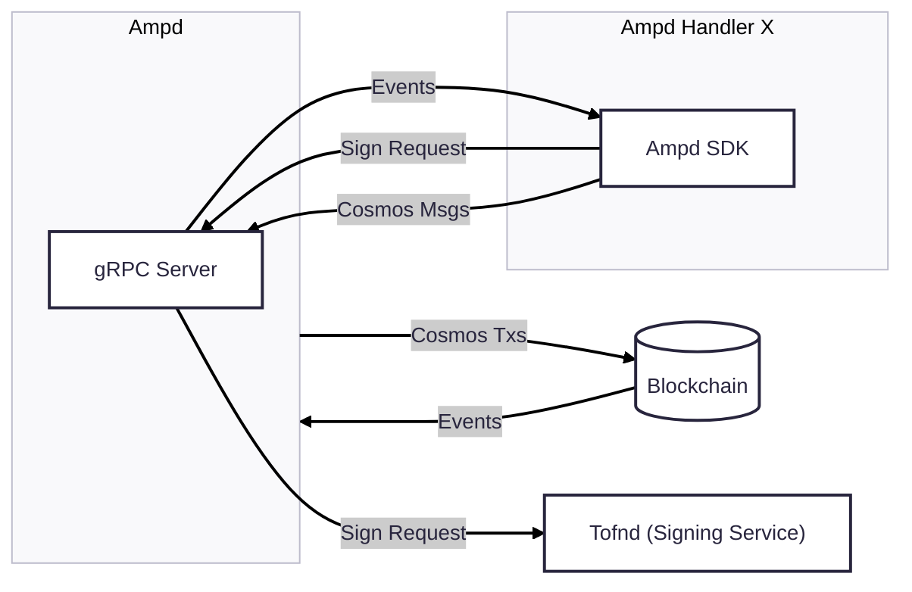
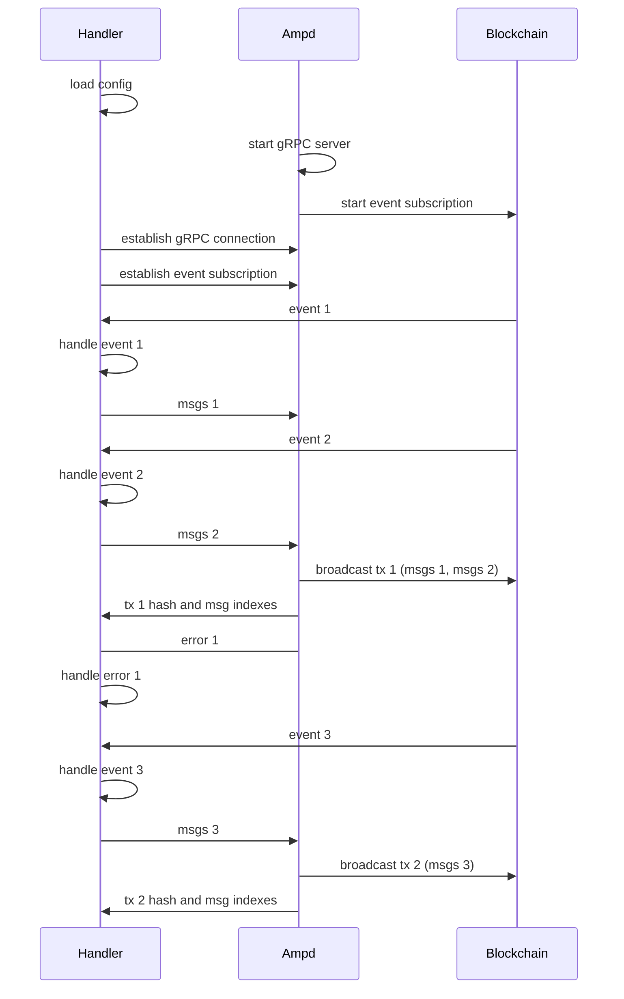

# ARC-6: Ampd Modularization

## Metadata

-  **ARC ID**: 6

-  **Author(s)**: Sammy Liu

-  **Status**: Draft

-  **Created**: 2025-04-02

-  **Last Updated**: 2025-04-06

-  **Target Implementation**: Q2-Q3 2025

## Summary

Ampd is a daemon service that connects to the Axelar blockchain network, providing essential functionalities for developers building applications on Axelar. This ARC outlines the architectural changes to make Ampd more modular, resilient, and developer-friendly.

## Background and Motivation

Currently, adding support for a new chain requires implementing a custom `EventHandler`, committing it to the Ampd repository, and undergoing a review by the Axelar team. Additionally, if any event handler crashes or contains bugs, Ampd shuts down entirely.

To address these limitations, we aim to make Ampd modular with the following objectives:

1. Allow developers to create custom event handlers without committing to the Ampd repository
2. Run event handlers as independent processes to prevent failures from affecting Ampd
3. Design the system to achieve these goals with minimal complexity

## Architecture

The Ampd repository will be split into two components: Ampd and Ampd SDK.

### Ampd

**Ampd** is a daemon that connects to the Axelar blockchain, offering functionalities such as:

- Event subscription
- Transaction broadcasting
- Contract queries
- Cryptographic signing

These functionalities are exposed via a gRPC interface, allowing external applications to interact with the Axelar blockchain through Ampd.

- Alerting when fund is running low or having connection issue with the blockchain, etc.

### Ampd SDK

**Ampd SDK** is a client library that enables developers to connect to Ampd and interact with it. The SDK provides:

- Interfaces and tools for building custom event handlers
- Client-side implementations for the gRPC server
- Utilities for event and query response deserialization
- Necessary traits for implementing custom event handlers

## gRPC Interface

Ampd implements a gRPC server based on the following protobuf definition:

```protobuf
syntax = "proto3";

import "google/protobuf/any.proto";

package ampd.v1;

enum Algorithm {
  ALGORITHM_UNSPECIFIED = 0;
  ALGORITHM_ECDSA = 1;
  ALGORITHM_ED25519 = 2;
}

message KeyId {
  string id = 1;
  Algorithm algorithm = 2;
}

message EventBlockBegin { uint64 height = 1; }

message EventBlockEnd { uint64 height = 1; }

message Event {
  string type = 1;
  string contract = 2; // empty when the event is not emitted by a contract
  map<string, string> attributes = 3;
}

message SubscribeRequest {
  // the subscription returns all events that match ANY of these filters
  repeated Event filters = 1;
  bool include_block_begin_end = 2;
}

message SubscribeResponse {
  oneof event {
    EventBlockBegin block_begin = 1;
    EventBlockEnd block_end = 2;
    Event abci = 3;
  }
}

message BroadcastRequest { google.protobuf.Any msg = 1; }

message BroadcastResponse {
  bytes tx_hash = 1;
  uint64 index = 2;
}

message QueryRequest {
  string contract = 1;
  string query = 2;
}

message QueryResponse { string result = 1; }

message AddressRequest {}

message AddressResponse { string address = 1; }

message ContractsRequest { string chain_name = 1; }

message ContractsResponse {
  string voting_verifier = 1;
  string multisig_prover = 2;
  string service_registry = 3;
  string rewards = 4;
}

message SignRequest {
  KeyId key_id = 1;
  bytes msg = 2;
}

message SignResponse { bytes signature = 1; }

message KeyRequest { KeyId key_id = 1; }

message KeyResponse { bytes pub_key = 1; }

service BlockchainService {
  /**
   * Subscribe streams events from the blockchain, starting from the current
   * height.
   *
   * The client can specify filters to receive only events that match the
   * filters. The client can also specify to include block begin and end events.
   *
   * @param SubscribeRequest Contains event filters and subscription options
   * @returns Stream of SubscribeResponse containing matching events
   *
   * Error Codes:
   * - Status DeadlineExceeded: No block received within the configured timeout
   * - Status DataLoss: Client cannot keep up with the event stream
   * - Status Unavailable: Network-related issues when connecting to the
   * blockchain node
   * - Status Internal: The received event cannot be decoded
   */
  rpc Subscribe(SubscribeRequest) returns (stream SubscribeResponse) {}

  /**
   * Broadcast sends a message to the blockchain and returns the transaction
   * hash and the index of the message in the transaction once it is
   * broadcasted.
   *
   * The message is potentially batched with other messages in the same
   * transaction.
   *
   * @param BroadcastRequest Contains the message to broadcast
   * @returns BroadcastResponse with the transaction hash and message index
   *
   * Error Codes:
   * - Status InvalidArgument: Message is invalid (fee estimation failure not
   * due to network issues)
   * - Status Unavailable: Network-related issues when connecting to the
   * blockchain node
   */
  rpc Broadcast(BroadcastRequest) returns (BroadcastResponse) {}

  /**
   * Query sends a query to a contract and returns the raw result in JSON
   * encoding.
   *
   * @param QueryRequest Contains the contract address and query in JSON format
   * @returns QueryResponse with the query result in JSON format
   *
   * Error Codes:
   * - Status InvalidArgument: Query is invalid JSON
   * - Status Unknown: Contract returns an error
   * - Status Unavailable: Network-related issues when connecting to the
   * blockchain node
   */
  rpc Query(QueryRequest) returns (QueryResponse) {}

  /**
   * Address returns the axelar address that ampd broadcasts transactions
   * from.
   *
   * @param AddressRequest
   * @returns AddressResponse with the address
   *
   * Error Codes:
   * - Status Internal: Address retrieval fails for any reason
   */
  rpc Address(AddressRequest) returns (AddressResponse) {}

  /**
   * Contracts returns the addresses of the amplifier contracts that event
   * handlers need to interact with.
   *
   * @param ContractsRequest Contains the chain name to query for the contracts
   * @returns ContractsResponse with the contract addresses
   *
   * Error Codes:
   * - Status InvalidArgument: Chain name is invalid
   * - Status NotFound: Chain name is not found
   * - Status Internal: Contract address retrieval fails for any reason
   */
  rpc Contracts(ContractsRequest) returns (ContractsResponse) {}
}

service CryptoService {
  /**
   * Sign signs the keccak256 hash of the given message with the specified key
   * ID.
   *
   * @param SignRequest Contains the key ID and the message to sign
   * @returns SignResponse with the signature
   *
   * Error Codes:
   * - Status Internal: Signing fails for any reason
   */
  rpc Sign(SignRequest) returns (SignResponse) {}

  /**
   * Key returns the public key of the specified key ID.
   *
   * @param KeyRequest Contains the key ID
   * @returns KeyResponse with the public key
   *
   * Error Codes:
   * - Status Internal: Key retrieval fails for any reason
   */
  rpc Key(KeyRequest) returns (KeyResponse) {}
}

```

Note that:

- No key ID is provided for the `Broadcast` call. Ampd will only sign Axelar transactions with the configured key ID. It crashes immediately if the account (returned by the `Address` call) is not created on chain.
- `Subscribe` starts from the latest block. The client cannot retrieve blocks retroactively.
- The Protobuf should reside in a separate location. Both Ampd and the SDK install it for the same version.

## Error Handling

All errors from the gRPC server will be returned with the appropriate [status code](https://grpc.io/docs/guides/status-codes/) according to gRPC's best practices. Each method in the service definitions includes documentation on the specific status codes it may return and their meaning.

## SDK Modules

The Ampd SDK consists of several modules:

### `grpc` Module

Responsible for:

- Connecting to the Ampd gRPC server
- Wrapping the raw gRPC client and implementing all client-side function calls
- Handling errors according to the status code
- Managing connection lifecycle

### `event` Module

Provides:

- A derive macro `from_event` to convert the `Event` type defined in the Protobuf into a specified structured type
- Integration with the existing [into_event macro](https://github.com/axelarnetwork/axelar-amplifier/blob/fed53af55c02d7195d2981f0e364d443309d0479/packages/axelar-wasm-std-derive/src/lib.rs#L160)
- Common types used in amplifier contracts
- `handler` **Module**:

    Responsible for:

    - Providing abstractions for running custom event handlers
    - Managing event handler lifecycle
    - Terminating event handlers gracefully
    - Handling errors, logging and recovery strategies

### `config` Module

Defines:

- Configuration structures containing common fields required for all event handlers (Ampd gRPC URL, event filters, etc.)
- Support for custom configuration fields, but only for one single hander
- Loading configurations from:
    - Default path
    - Path provided by a command line argument
    - Path provided by an environment variable

### `mock` Module

Provides:

- Mock implementations of the gRPC client for testing
- Simulated blockchain events for development
- Test utilities for event handlers

This module is only included when a specific feature flag is enabled.

## Implementing Custom Event Handlers

Developers can create custom event handlers by implementing the `EventHandler` trait provided by the SDK. Here's a simple example of how a custom event handler would be implemented:

```rust
#[async_trait]
pub trait EventHandler {
    type Err: error_stack::Context;
    type Event: From<proto::Event>;

    async fn handle(
        &self,
        env: &Environment,
        event: Self::Event,
    ) -> error_stack::Result<Vec<Any>, Self::Err>; // Consider which mod is Env defined in, but it wrapps config, ampd client, etc, and can be created like `mock_env()`
}

impl EventHandler for Handler {
    ...
}

fn main() {
    ...

    let ... = ampd::event_handler::new(ampd::Client::new(...))
                .with_config(config)   // also allow .with_config_path(path) so they don't have to read the config themselves
                .with_handler(Handler::new(...))
                .run(cancellation_token)

    ...
}

```

Developers only need to implement the `handle` method for their `EventHandler`. The SDK abstracts away the complexities of stream handling, connection management, and error recovery. The custom even handler should also check all of its specific pre-conditions before running the subscription.

## Architecture Diagram



- Ampd is responsible for event subscription from the blockchain and for broadcasting transactions.
- Ampd operates a gRPC server at a known address for the handlers to communicate with.
- Handlers receive events from Ampd, request signing from Ampd, and broadcasting transaction via Ampd
- Handlers are stateless, meaning events are always consumed from the tip of the blockchain for the following reasons
    - in the vast majority of cases we actually don’t want plugins to react to old events
    - with the amplifier protocol any step can be repeated any number of times, so if verification failed for an event or was missed, it can simply be repeated
    - this drastically reduces the complexity of the design
- Handlers take care of event deserialization
- External developers only need to define the event handling logic and handler-specific configurations

### Execution sequence


## Future Work

- **Tofnd Replacement**: Tofnd currently only supports ECDSA and ED25519 and is not maintained. We should explore replacing it with existing signing services that are more secure and powerful, or moving the cryptographic features into Ampd itself.
- **Explore Available gRPC Proxies**: Event handlers would connect to the proxy instead of Ampd directly so that Ampd never needs to maintain more than one connection.
- **Contracts Discovery**: Once amplifier supports this feature, Ampd will no longer need to be configured with amplifier's contract addresses but can query them on boot.
- **Further Language Support**: Extend the SDK to support additional programming languages. TypeScript and Go are potentially strong candidates.
