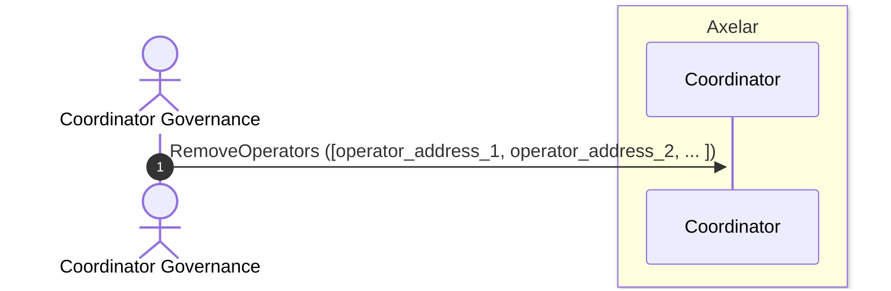
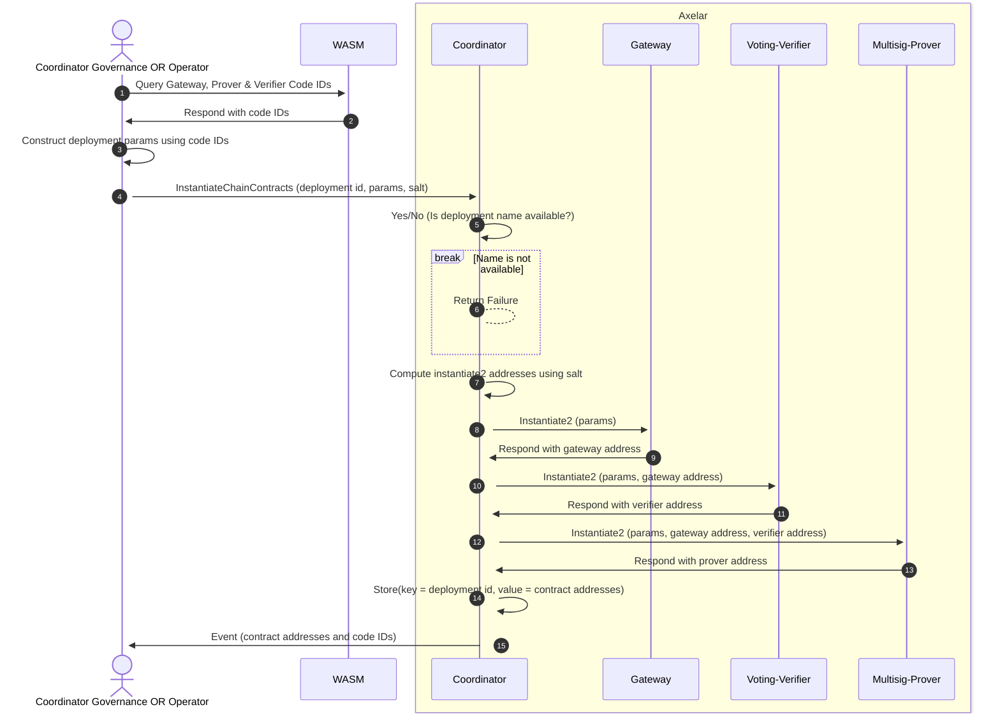
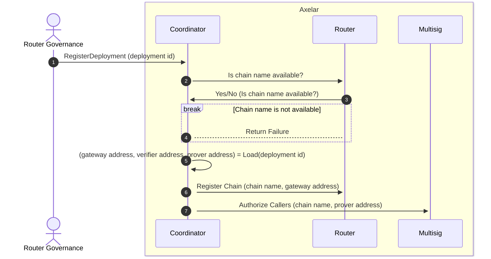

# ARC-8: Amplifier Coordinator One-Click Deployment

  

## Metadata

  

-  **ARC ID**: 8

-  **Author(s)**: Solomon Davidson

-  **Status**: Draft

-  **Created**: 2025-04-25

-  **Last Updated**: 2025-08-25

-  **Target Implementation**: Q2 2025

  

## Summary

This ARC defines the requirements and design for the one-click deployment of blockchains to the Axelar network using the coordinator contract. The coordinator will be able to deploy the internal gateway, voting verifier and prover contracts for a particular blockchain from a single transaction. A single governance proposal will then register these contracts with the protocol.
  
## Background

When adding Amplifier support for a new blockchain on Axelar, the following three smart contracts that must be deployed for that blockchain:

- **Internal Gateway:** When sending a message from a source chain to a destination chain, a relayer will submit the hash of that message to the source chain’s corresponding internal gateway.
- **Voting Verifier:** Submitting a message hash to an internal gateway triggers a poll. Verifiers will then vote on whether or not that message succeeded on the source chain. The voting verifier contract manages these polls.
- **Prover:** Messages that have been verified are ultimately routed to the destination chain’s internal gateway. The prover starts a process during which the verifiers for the destination chain sign the hash of each message. These signatures can be queried from the prover, and submitted to the destination chain to prove the existence of a message.

Currently, registering a chain with the amplifier can be cumbersome, as it requires performing many independent steps. First, each of the three aforementioned contracts must be instantiated. Following that, the gateway must be registered with the router contract, and the prover must be registered with both the coordinator and the multisig contracts. This all accounts for several governance proposals, where each proposal must be supplied with the correct configuration parameters.

In order to make this process less tedious and error prone, we have deployment scripts that automate many of these steps. This ARC takes this a step further by integrating the steps for chain deployment into the amplifier.

## Proposed

ARC-8 proposes that a single transaction be used to instantiate all three amplifier contracts. Once instantiated, these contracts can be registered with the protocol using a single governance proposal, at which point they can be used for general message passing.

### Requirements

- **Dependency Resolution:** The coordinator must be able to resolve all dependencies between the gateway, voting verifier and prover. The user must only be responsible for supplying chain specific information that cannot be otherwise inferred. This includes the code IDs for each contract.

- **Chain Name Uniqueness:** The router is responsible for directing messages between gateways. In order to ensure lack of ambiguity, the router enforces that chain names are unique. The coordinator should not interfere with this process. This means:
    - A user cannot register contracts using a chain name that is already registered in the router.
    - A user should not be able to block chain names from being used in the future.
    
    This will likely require coordination between the coordinator and the router contracts. Furthermore, the governance address should be able to correct/enforce the blockchain naming scheme where necessary.

- **Coordinator Instantiation Permission:** The coordinator contract address must have permission to instantiate contracts.

### Definitions

- **Operator**: Any account that has permission to instantiate a gateway, voting verifier and prover. Given a code id *n*, these accounts can be queried from the GRPC endpoint
- **Coordinator Governance**: The governance account provided in the coordinator's instantiation message.
- **Router Governance**: The governance account provided in the router's instantiation message.
- **Deployment Name**: Human readable name for the instantiation of a gateway, voting verifier and multisig prover. Deployment names MUST be unique. Deployment names SHOULD be similar to the intended chain name.
- **Chain Name**: Human readable chain name that will be registered with the router.
- **Salt**: Bytes provided to CosmWasm's Instantiate2 message to ensure predictable addressing. Salts MUST be unique to ensure contracts with the same bytecode are not given the same address (although, this is already enforced by the wasm module). Salts MAY be the same as the deployment name.

### Types

The public interface for executing transactions on the coordinator is enhanced as follows.

```rust
pub enum ExecuteMsg {
    ...

    #[permission(Governance)]
    AddOperators { operators: HashSet<Addr> },

    #[permission(Governance)]
    RemoveOperators { operators: HashSet<Addr> },

    #[permission(Governance, Specific(operator))]
    InstantiateChainContracts {
        deployment_name: nonempty::String,
        salt: Binary,
        // Make params a Box to avoid having a large discrepancy in variant sizes
        // Such an error will be flagged by "cargo clippy..."
        params: Box<DeploymentParams>,
    },

    /// `RegisterDeployment` calls the router using `ExecuteMsgFromProxy`.
    /// The router will enforce that the original sender has
    /// permission to register the deployment.
    #[permission(Governance)]
    RegisterDeployment { deployment_name: nonempty::String },
}
```

The following custom types are used.

```rust
pub struct ChainName(String);
type ProverAddress = Addr;
type GatewayAddress = Addr;
type VerifierAddress = Addr;

pub struct ContractInfo<T> {
    pub code_id: u64,
    pub label: String,
    pub msg: T,
    pub contract_admin: Addr,
}

pub struct ManualDeploymentParams {
    pub gateway: ContractInfo<()>,
    pub verifier: ContractInfo<VerifierMsg>,
    pub prover: ContractInfo<ProverMsg>,
}

// The parameters used to configure each instantiation.
// This is an enum to allow for additional parameter types in the future
pub enum DeploymentParams {
    Manual(ManualDeploymentParams), // user supplies info that cannot be inferred
}

pub struct ChainContractsResponse {
    pub chain_name: ChainName,
    pub prover_address: ProverAddress,
    pub gateway_address: GatewayAddress,
    pub verifier_address: VerifierAddress,
}
```

Provided below are configuration parameters that must be supplied by the user. Currently, these parameters cannot be automatically inferred by the amplifier.

```rust
pub struct ProverMsg {
    pub governance_address: String,
    pub multisig_address: String,
    pub signing_threshold: MajorityThreshold,
    pub service_name: String,
    pub chain_name: String,
    pub verifier_set_diff_threshold: u32,
    pub encoder: Encoder,
    pub key_type: KeyType,
    #[serde(with = "axelar_wasm_std::hex")] // (de)serialization with hex module
    #[schemars(with = "String")] // necessary attribute in conjunction with #[serde(with ...)]
    pub domain_separator: Hash,
}

#[cw_serde]
pub struct VerifierMsg {
    pub governance_address: nonempty::String,
    pub service_name: nonempty::String,
    pub source_gateway_address: nonempty::String,
    pub voting_threshold: MajorityThreshold,
    pub block_expiry: nonempty::Uint64,
    pub confirmation_height: u64,
    pub source_chain: ChainName,
    pub rewards_address: nonempty::String,
    pub msg_id_format: MessageIdFormat,
    pub address_format: AddressFormat,
}
```

## One-Click Deployment Design

### 1. Uploading Contracts

The bytecode for the gateway, voting verifier and prover must first be stored on Axelar. This will be done using governance proposals.

### 2. Managing Operators

Operators can be registered with or removed from the coordinator. In order to avoid having an unecessary amount of proposals, multiple operators can be registered or removed with the same proposal.

#### Register


#### Remove



### 3. Contract Instantiation

We first instantiate contracts in a separate step before registering them. This ensures that:
1. Chain operators have the opportunity to correct configuration mistakes before registering their amplifier contracts with the protocol.
2. Instantiation can be performed by authorized accounts without requiring a governance proposal.



### 4. Chain Registration

A governance proposal registers the amplifier contracts with the protocol in this step.



<!-- May add the following later to the chain registration process -->
<!-- participant Rewards -->
<!-- Coordinator->>+Rewards: Create Pool(verifier rewards params, verifier address) -->
<!-- Coordinator->>+Rewards: Create Pool(multisig rewards params, multisig address) -->

## References

Draft PR: https://github.com/axelarnetwork/axelar-amplifier/pull/843
Coordinator v2.0.0 Release: https://github.com/axelarnetwork/axelar-amplifier/tree/coordinator-v2.0.0
  
## Changelog

| Date | Revision | Author | Description |
|------|-----------|---------|-------------|
| 2024-01-14 | v1.0 | Solomon Davidson | Initial ARC draft |
| 2025-05-05 | v1.1 | Solomon Davidson | Preliminary diagram designs |
| 2025-05-12 | v1.2 | Solomon Davidson | Add pseudocode and chain registration design |
| 2025-05-23 | v1.3 | Solomon Davidson | Incorperate multisig and rewards proposals. Reformatting |
| 2025-08-13 | v1.4 | Solomon Davidson | Add details about registering a deployment |
| 2025-08-14 | v1.5 | Solomon Davidson | Remove unecessary code |
| 2025-08-25 | v1.6 | Solomon Davidson | Proposed section added and general reformatting|
