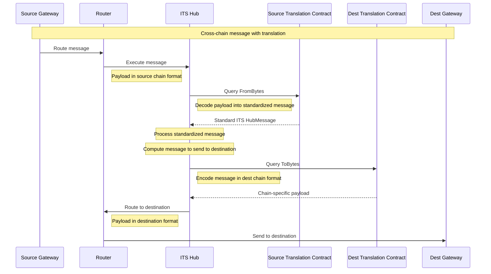

# ARC-10: ITS Hub Translation Hooks

## Metadata

-  **ARC ID**: 10

-  **Author(s)**: CJ Cobb (@cjcobb23)

-  **Status**: Draft

-  **Created**: 2025-06-17

-  **Last Updated**: 2025-06-17

-  **Target Implementation**: [TBD]

  

## Abstract

This ARC proposes the addition of translation hooks to the Interchain Token Service (ITS) Hub to enable seamless message translation between chain-specific payload formats and the standardized `interchain_token_service::Message` type. Each registered chain will include a translation contract that provides bidirectional conversion capabilities.

## Motivation

Different blockchain networks use varying message formats and payload structures. To enable seamless interoperability through the ITS Hub, there needs to be a standardized way to translate between chain-specific formats and the hub's internal message format. This ensures ITS contracts on connected chains can communicate with each other even if using a different payload format.

For example, the Stacks integration uses a custom encoding scheme, and does not have any ABI encoding/decoding libraries available on chain. Adding translation hooks allows the stacks ITS contracts to communicate seamlessly with the EVM ITS contracts, by allowing the hub to perform the proper translation.


## Specification

### Translation Contract Interface

Each registered chain must provide a translation contract that implements the following interface:

#### Core Functions

The translation contract must implement the following CosmWasm query interface:

```rust
#[cw_serde]
#[derive(QueryResponses)]
pub enum QueryMsg {
    #[returns(interchain_token_service::primitives::HubMessage)]
    FromBytes { payload: HexBinary },
    
    #[returns(HexBinary)]
    ToBytes { message: interchain_token_service::primitives::HubMessage },
}
```

1. **FromBytes**: Converts chain-specific raw payload to standardized ITS Hub Message format
   - Takes `payload: HexBinary` containing the raw payload encoded in the chain-specific format
   - Validates payload structure and extracts relevant fields
   - Returns standardized `interchain_token_service::primitives::HubMessage` or error if translation fails

2. **ToBytes**: Converts standardized ITS Hub Message to chain-specific payload format
   - Takes `message: interchain_token_service::primitives::HubMessage` 
   - Encodes message fields according to target chain requirements
   - Returns `HexBinary` representing the payload encoded in the chain specific format or error if translation fails

### Chain Registration Enhancement

The chain registration process will be enhanced to include translation contract information. The `ChainConfig` structure will be updated to include the translation contract address:

```rust
#[cw_serde]
pub struct ChainConfig {
    pub chain: ChainNameRaw,
    pub its_edge_contract: Address,
    pub truncation: TruncationConfig,
    pub translation_contract: Address,
}
```

This is used in the ITS Hub's `RegisterChains` command:

```rust
#[cw_serde]
pub enum ExecuteMsg {
    RegisterChains { 
        chains: Vec<ChainConfig> 
    },
    // ... other execute messages
}
```

For existing chains that use ABI encoding, an ABI translation contract will be added to provide the standard translation interface.

### Translation Contract Modification

Registered translation contracts can be safely changed using the existing `UpdateChains` command. The `ChainConfig` structure allows for updating the `translation_contract` address for registered chains:

```rust
#[cw_serde]
pub enum ExecuteMsg {
    UpdateChains { 
        chains: Vec<ChainConfig> 
    },
    // ... other execute messages
}
```

**Safety Considerations:**

Translation contract upgrades are safe to perform because:

1. **Translation occurs during execution**: The translation from chain-specific payload format to standardized ITS Message format happens during message execution, not during message verification or routing.

2. **Single execution guarantee**: The Axelarnet gateway ensures that each cross-chain message can only be executed once, preventing replay attacks or inconsistent translations.

3. **Atomic updates**: When a translation contract is updated via `UpdateChains`, all subsequent messages from that chain will use the new translation contract, ensuring consistency.

This design allows for translation logic improvements, bug fixes, and support for new message formats without compromising the security or integrity of the ITS Hub.

### Message Flow Diagram

The following sequence diagram illustrates the message flow through the ITS Hub with translation hooks:



## Implementation

### Contract Migration

The implementation of this ARC will require a migration of the existing ITS Hub contract to add translation contract support. This migration will include:

1. **Schema Updates**: Update the `ChainConfig` structure to include the required `translation_contract` field
2. **ABI Translation Contract Deployment**: Deploy a new ABI translation contract that contains the existing ABI encoding/decoding logic currently embedded in the ITS Hub
3. **Chain Registration Updates**: Register translation contracts for all existing chains during the migration

### Translation Contract Registration

All existing chains will need to have translation contracts registered during the migration process:

- **Most chains**: Will use the standard ABI translation contract, which implements the same ABI encoding/decoding logic that currently exists within the ITS Hub
- **Custom chains**: Chains with non-ABI formats can have custom translation contracts deployed

### Design Consistency

Moving the existing ABI logic to a separate translation contract serves several purposes:

1. **Consistency**: All chains will use translation contracts, making the system uniform rather than having translation be optional
2. **Simplicity**: The ITS Hub logic becomes cleaner by removing embedded translation logic
3. **Extensibility**: New chains with different formats can be easily added without modifying the core ITS Hub contract
4. **Maintainability**: Translation logic is isolated and can be updated independently

The ABI translation contract will essentially extract the current ABI encoding/decoding functionality from the ITS Hub and expose it through the standardized `FromBytes` and `ToBytes` query interface.