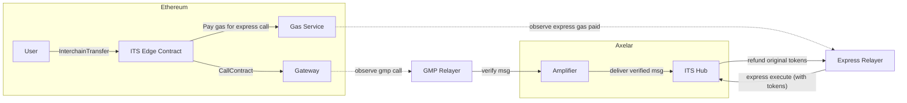
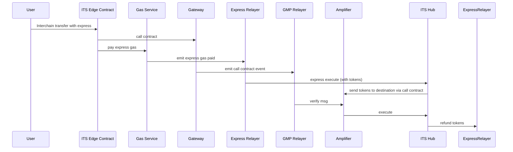

# ARC-5: ITS Hub Express
## Metadata

  

-  **ARC ID**: 5

-  **Author(s)**: CJ Cobb

-  **Status**: Draft

-  **Created**: 2025-03-20

-  **Last Updated**: 2025-03-28

-  **Target Implementation**: Q2 2025


## Background

GMP Express is a feature that allows GMP calls to be executed at the destination contract prior to the GMP call
being fully verified by Axelar. This is most commonly used for token transfers. The express relayer will facilitate
the transfer using its own tokens, and will be reimbursed those tokens later when the verified GMP message arrives.

This process uses the message id to map an expressed GMP call to the actual GMP call. However, transfers using ITS
hub actually involve two GMP calls (source to hub, and then hub to destination), each with their own message id.
Therefore, when the GMP message is initially sent at the source, the final message id that will be seen by the
destination is not yet known. Thus, the existing design of GMP express does not work with ITS hub.

## Proposed Solution

The proposed solution is to express the first GMP call of the transfer, specifically the GMP call from the source
chain to the hub. This is typically much slower than the second hop, since fully verifying the first hop requires
waiting for finality. Expressing to the hub also simplifies operational overhead for express relayers, since the
relayers only need to maintain token balances on one chain (Axelarnet), instead of many destination chains.

#### Architecture



#### Sequence


### API
ITS Hub will expose a new executable message, `ExpressExecute` that faciliates express execution:
```rust
enum ExecuteMsg {
    Execute(AxelarExecutableMessage),
    
    ExpressExecute(AxelarExecutableMessage),
}
```
The express relayer should attach funds to this message, and the hub will store the relayer address for refunding later. Then the hub will create the second GMP call to send the funds to the destination.
When the verified message arrives later and is executed via `Execute`, the hub will refund the relayer and not initiate a second GMP call to the destination.
The call will error if the relayer does not provide enough funds or the right denom, if the call is not an interchain transfer, or if the call contains attached data and the app has not whitelisted itself to receive data (see Passing Data below)

### Token Minting
To loan tokens for the express calls, the express relayer needs to maintain a balance of the token on Axelar. None of these tokens exist on Axelar today. To enable this, ITS Edge contracts will be developed in cosmwasm and deployed on Axelar, to enable users to deploy their token to Axelar itself, and send the express relayer some amount
of funds to begin relaying.

Question: should these tokens just be minted as Cosmos SDK coins, or should we use something smart contract based, like [cw 20](https://github.com/CosmWasm/cw-plus/blob/main/packages/cw20/README.md)? 

### Passing Data
ITS allows callers to attach arbitrary data to a transfer, which can be used to execute additional logic when the transfer is received. Expressing transfers with arbitrary data attached is not universally safe, because the express
relayer could lie about the contents of the data, and the app has no way of knowing. Usually, apps opt in or out of
this behavior by defining a specific endpoint. However, with ITS hub this is not possible, since only the first leg
of the call will be expressed, and the app has no way of knowing.

The solution is to maintain a whitelist in ITS hub of apps that can receive express executed transfers with data.
Apps can add themselves to this whitelist by sending a special call to the hub. This message type will be a variant
of `HubMessage` and will be handled similarly to `RegisterTokenMetadata`

```rust

struct AllowExpressExecution {
    contract_address: HexBinary,
}
```

There will be a method on the edge contract that allows apps to whitelist themselves.

### Components to build

* Express execute endpoint and refund logic on ITS hub
* ITS edge contract on Axelar (for minting)
* Enable token minting on Axelar in core
* Functionality for apps to allow attaching calldata to express execution