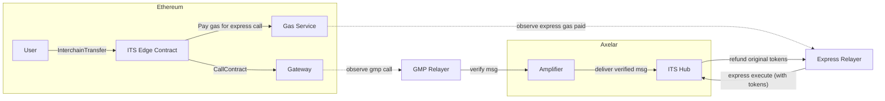

# ARC-4: ITS Hub Express
## Metadata

  

-  **ARC ID**: 4

-  **Author(s)**: CJ Cobb

-  **Status**: Draft

-  **Created**: 2025-03-20

-  **Last Updated**: 2025-03-20

-  **Target Implementation**: Q2 2025

## Background

GMP Express is a feature that allows GMP calls to be executed at the destination contract prior to the GMP call
being fully verified by Axelar. This is most commonly used for token transfers. The express relayer will facilitate
the transfer using its own tokens, and will be reimbursed those tokens later when the verified GMP message arrives.

This process uses the message id to map an expressed GMP call to the actual GMP call. However, transfers using ITS
hub actually involve two GMP calls (source to hub, and then hub to destination), each with their own message id.
Therefore, when the GMP message is initially sent at the source, the final message id that will be seen by the
destination is not yet known. Thus, the existing design of GMP express does not work with ITS hub.

## Proposed Solution

The proposed solution is to express the first GMP call of the transfer, specifically the GMP call from the source
chain to the hub. This is typically much slower than the second hop, since fully verifying the first hop requires
waiting for finality. Expressing to the hub also simplifies operational overhead for express relayers, since the
relayers only need to maintain token balances on one chain (Axelarnet), instead of many destination chains.

### Flow

TODO: deployment flow

TODO: sequence diagram

### Considerations

Express execution of arbitrary contract calls is not universally safe, and usually apps opt in to express execution
of calldata via defining a particular endpoint on their contract. However, when we express to ITS hub instead of to
the receiving app, apps cannot opt in or out of call execution in the normal way. We need to design a way to allow
apps to opt in.

Two options:
* Maintain a whitelist in ITS hub, which can be updated by governance.
* Set a flag in the ITS packet sent to the receiving app signaling whether the call was expressed. Apps can choose
to ignore expressed calls.

The second approach requires changing the ITS packet format, which would require upgrading existing ITS edge
contracts, and would be an additional requirement for integrators. (would this also break existing ITS apps?).

### Components to build

* Express execute endpoint and refund logic on ITS hub
* ITS edge contract on Axelar (for minting)
* Enable token minting on Axelar in core
* Functionality for apps to allow attaching calldata to express execution