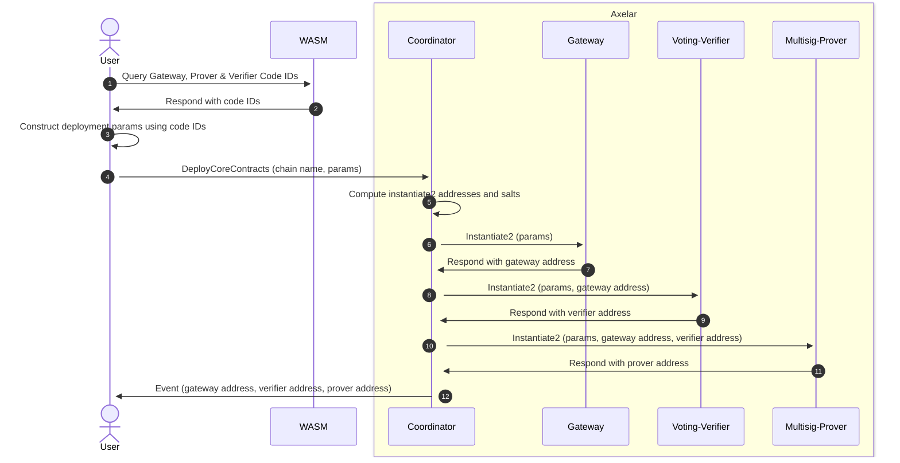

# ARC-8: Amplifier Coordinator One-Click Deployment

  

## Metadata

  

-  **ARC ID**: 8

-  **Author(s)**: Solomon Davidson

-  **Status**: Draft

-  **Created**: 2025-04-25

-  **Last Updated**: 2025-05-05

-  **Target Implementation**: Q2 2025

  

## Summary

This ARC defines the requirements and design for the one-click deployment of blockchains to the Axelar network using the Coordinator contract. The Coordinator will be able to deploy the Internal Gateway, Voting Verifier and Prover contracts for a particular blockchain from a single transaction.

## Motivation

  
### Background

When adding Amplifier support for a new blockchain on Axelar, there are three smart contracts that must be deployed for that blockchain. They are as follows:

- **Internal Gateway:** When sending a message from a source chain to a destination chain, a relayer will submit the hash of that message to the source chain’s corresponding internal Gateway.
- **Voting Verifier:** Submitting a message hash to an internal Gateway triggers a poll. Verifiers will then vote on whether or not that message succeeded on the source chain. The Voting Verifier contract manages these polls.
- **Prover:** Messages that have been verified will ultimately be routed to the destination chain’s internal Gateway. The Prover starts a process during which the verifiers for the destination chain sign the hash of each message. These signatures can be queried from the Prover, and submitted to the destination chain.

Instantiating these contracts can be tedious, as they must each be provided with the correct interdependent parameters. Consequently, there are deployment scripts that automate this process. This project takes this a step further, and allows for each contract to be correctly instantiated from a single transaction.

## Requirements

- **Dependency Resolution:** The coordinator must be able to resolve all dependencies between the Gateway, Voting Verifier and Prover. The user must only be responsible for supplying chain specific information that cannot be otherwise inferred. This includes the code IDs for the gateway, verifier and prover.
- **Chain Name Uniqueness:** The router is responsible for directing messages between gateways. In order to ensure unambiguity, the router enforces chain names to be unique. The coordinator should not interfere with this process. This means:
    - A user cannot deploy contracts using a chain name that is already registered in the router.
    - A user cannot deploy contracts using a chain name that was already deployed using the coordinator.
    - A user should not be able to block chain names from being used in the future.
    
    This will likely require coordination between the coordinator and the router contracts. Furthermore, the governance address should be able to correct/enforce the blockchain naming scheme where necessary.

## Detailed Design

### References
Draft PR: https://github.com/axelarnetwork/axelar-amplifier/pull/823
  
### Changelog
