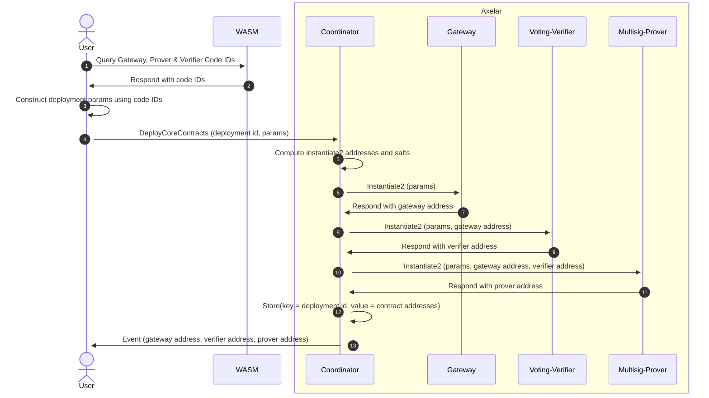
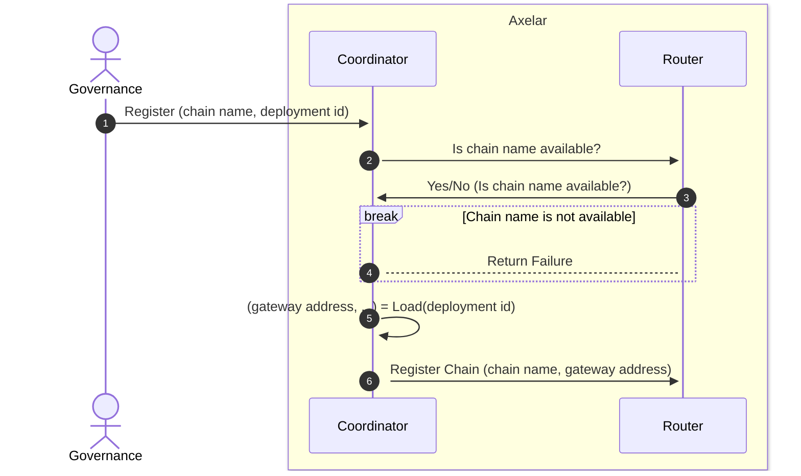

# ARC-8: Amplifier Coordinator One-Click Deployment

  

## Metadata

  

-  **ARC ID**: 8

-  **Author(s)**: Solomon Davidson

-  **Status**: Draft

-  **Created**: 2025-04-25

-  **Last Updated**: 2025-05-12

-  **Target Implementation**: Q2 2025

  

## Summary

This ARC defines the requirements and design for the one-click deployment of blockchains to the Axelar network using the coordinator contract. The coordinator will be able to deploy the internal gateway, voting verifier and prover contracts for a particular blockchain from a single transaction.

## Motivation

  
### Background

When adding Amplifier support for a new blockchain on Axelar, the following three smart contracts that must be deployed for that blockchain:

- **Internal Gateway:** When sending a message from a source chain to a destination chain, a relayer will submit the hash of that message to the source chain’s corresponding internal gateway.
- **Voting Verifier:** Submitting a message hash to an internal gateway triggers a poll. Verifiers will then vote on whether or not that message succeeded on the source chain. The voting verifier contract manages these polls.
- **Prover:** Messages that have been verified are ultimately routed to the destination chain’s internal gateway. The prover starts a process during which the verifiers for the destination chain sign the hash of each message. These signatures can be queried from the prover, and submitted to the destination chain to prove the existance of a message.

Instantiating these contracts can be tedious, as they must each be provided with the correct interdependent parameters. Consequently, there are deployment scripts that automate this process. This project takes this a step further, and allows for each contract to be correctly instantiated from a single transaction. Once instantiated, these contracts can be registered with the router, and used for future message passing.

## Requirements

- **Dependency Resolution:** The coordinator must be able to resolve all dependencies between the gateway, voting verifier and prover. The user must only be responsible for supplying chain specific information that cannot be otherwise inferred. This includes the code IDs for each contract.

- **Chain Name Uniqueness:** The router is responsible for directing messages between gateways. In order to ensure unambiguity, the router enforces that chain names are unique. The coordinator should not interfere with this process. This means:
    - A user cannot register contracts using a chain name that is already registered in the router.
    - A user should not be able to block chain names from being used in the future.
    
    This will likely require coordination between the coordinator and the router contracts. Furthermore, the governance address should be able to correct/enforce the blockchain naming scheme where necessary.

## Design

### Contract Instantiation



### Chain Registration



## Implementation

### Types

The public interface for executing transactions on the coordinator is enhanced as follows.

```rust
pub enum ExecuteMsg {
    ...

    DeployCoreContracts {
        chain_name: ChainName,
        params: DeploymentParams,
    }
}
```

The following custom types are used.

The following custom types are used.

```rust
pub struct ChainName(String);
type ProverAddress = Addr;
type GatewayAddress = Addr;
type VerifierAddress = Addr;

pub struct Config {
    pub service_registry: Addr,
    pub router: Addr,
    pub multisig: Addr,
}

pub enum DeploymentParams {
    Manual {
        gateway_code_id: u64,
        gateway_label: String,
        verifier_code_id: u64,
        verifier_label: String,
        verifier_msg: VerifierMsg,
        prover_code_id: u64,
        prover_label: String,
        prover_msg: ProverMsg,
    },
    // Enum to allow for future deployment parameters
}

pub struct ChainContractsResponse {
    pub chain_name: ChainName,
    pub prover_address: ProverAddress,
    pub gateway_address: GatewayAddress,
    pub verifier_address: VerifierAddress,
}
```

The following instantiation messages are used for each contract.

```rust
pub struct GatewayInstantiateMsg {
    /// Address of the verifier contract on axelar associated with the source chain. E.g., the voting verifier contract.
    pub verifier_address: String,
    /// Address of the router contract on axelar.
    pub router_addressString,
}

pub struct VerifierInstantiateMsg {
    /// Address that can call all messages of unrestricted governance permission level, like UpdateVotingThreshold.
    /// It can execute messages that bypasses verification checks to rescue the contract if it got into an otherwise unrecoverable state due to external forces.
    /// On mainnet it should match the address of the Cosmos governance module.
    pub governance_address: nonempty::String,
    /// Service registry contract address on axelar.
    pub service_registry_address: nonempty::String,
    /// Name of service in the service registry for which verifiers are registered.
    pub service_name: nonempty::String,
    /// Axelar's gateway contract address on the source chain
    pub source_gateway_address: nonempty::String,
    /// Threshold of weighted votes required for voting to be considered complete for a particular message
    pub voting_threshold: MajorityThreshold,
    /// The number of blocks after which a poll expires
    pub block_expiry: nonempty::Uint64,
    /// The number of blocks to wait for on the source chain before considering a transaction final
    pub confirmation_height: u64,
    /// Name of the source chain
    pub source_chain: ChainName,
    /// Rewards contract address on axelar.
    pub rewards_address: nonempty::String,
    /// Format that incoming messages should use for the id field of CrossChainId
    pub msg_id_format: MessageIdFormat,
    pub address_format: AddressFormat,

pub struct ProverInstantiateMsg {
    /// Address that can execute all messages that either have unrestricted or admin permission level, such as Updateverifier set.
    /// Should be set to a trusted address that can react to unexpected interruptions to the contract's operation.
    pub admin_address: String,
    /// Address that can call all messages of unrestricted, admin and governance permission level, such as UpdateSigningThreshold.
    /// This address can execute messages that bypasses verification checks to rescue the contract if it got into an otherwise unrecoverable state due to external forces.
    /// On mainnet, it should match the address of the Cosmos governance module.
    pub governance_address: String,
    /// Address of the gateway on axelar associated with the destination chain. For example, if this prover is creating proofs to
    /// be relayed to Ethereum, this is the address of the gateway on Axelar for Ethereum.
    pub gateway_address: String,
    /// Address of the multisig contract on axelar.
    pub multisig_address: String,
    /// Address of the coordinator contract on axelar.
    pub coordinator_address: String,
    /// Address of the service registry contract on axelar.
    pub service_registry_address: String,
    /// Address of the voting verifier contract on axelar associated with the destination chain. For example, if this prover is creating
    /// proofs to be relayed to Ethereum, this is the address of the voting verifier for Ethereum.
    pub voting_verifier_address: String,
    /// Threshold of weighted signatures required for signing to be considered complete
    pub signing_threshold: MajorityThreshold,
    /// Name of service in the service registry for which verifiers are registered.
    pub service_name: String,
    /// Name of chain for which this prover contract creates proofs.
    pub chain_name: String,
    /// Maximum tolerable difference between currently active verifier set and registered verifier set.
    /// The verifier set registered in the service registry must be different by more than this number
    /// of verifiers before calling UpdateVerifierSet. For example, if this is set to 1, UpdateVerifierSet
    /// will fail unless the registered verifier set and active verifier set differ by more than 1.
    pub verifier_set_diff_threshold: u32,
    /// Type of encoding to use for signed payload. Blockchains can encode their execution payloads in various ways (ABI, BCS, etc).
    /// This defines the specific encoding type to use for this prover, which should correspond to the encoding type used by the gateway
    /// deployed on the destination chain.
    pub encoder: Encoder,
    /// Public key type verifiers use for signing payload. Different blockchains support different cryptographic signature algorithms (ECDSA, Ed25519, etc).
    /// This defines the specific signature algorithm to use for this prover, which should correspond to the signature algorithm used by the gateway
    /// deployed on the destination chain. The multisig contract supports multiple public keys per verifier (each a different type of key), and this
    /// parameter controls which registered public key to use for signing for each verifier registered to the destination chain.
    pub key_type: KeyType,
    /// An opaque value created to distinguish distinct chains that the external gateway should be initialized with.
    /// Value must be a String in hex format without `0x`, e.g. "598ba04d225cec385d1ce3cf3c9a076af803aa5c614bc0e0d176f04ac8d28f55".
    #[serde(with = "axelar_wasm_std::hex")] // (de)serialization with hex module
    #[schemars(with = "String")] // necessary attribute in conjunction with #[serde(with ...)]
    pub domain_separator: Hash,
}
```

Provided below are configuration parameters that must be supplied by the user. Currently, these parameters cannot be automatically inferred by the amplifier.

```rust
pub struct ProverMsg {
    pub governance_address: String,
    pub multisig_address: String,
    pub signing_threshold: MajorityThreshold,
    pub service_name: String,
    pub chain_name: String,
    pub verifier_set_diff_threshold: u32,
    pub encoder: Encoder,
    pub key_type: KeyType,
    #[serde(with = "axelar_wasm_std::hex")] // (de)serialization with hex module
    #[schemars(with = "String")] // necessary attribute in conjunction with #[serde(with ...)]
    pub domain_separator: Hash,
}

pub struct VerifierMsg {
    pub governance_address: String,
    pub service_name: String,
    pub source_gateway_address: String,
    pub voting_threshold: MajorityThreshold,
    pub block_expiry: nonempty::Uint64,
    pub confirmation_height: u64,
    pub source_chain: ChainName,
    pub rewards_address: nonempty::String,
    pub msg_id_format: MessageIdFormat,
    pub address_format: AddressFormat,
}
```

### Interface & Pseudo-Code

```rust
pub fn deploy_core_contracts(
    chain_name: ChainName,           // Name of the new blockchain
    params: DeploymentParams,        // Parameters for deployment
) -> Result<Response, ContractError> {
	// The results that will be returned
	let mut result = Result::new();
	let config: Config = load_config();
	
	// Make sure the chain name is not in use
	if router_registered(chain_name) || coordinator_deployed(chain_name) {
		return Err(ContractError);
	}
	
	// Compute new verifier and gateway address based on each contract's
	// code hash and a generated salt.
	let verifier_salt = get_salt();
	let gateway_salt = get_salt();
	
	let new_gateway_addr: Addr = compute_instantiate2_address(
		chain_contracts.gateway_address,
		salt_2
	);
	
	let salt_3 = get_salt();
	let new_prover_addr: Addr = compute_instantiate2_address(
		chain_contracts.prover_address,
		salt_3
	);
	
	match params {
		 DeploymentParams::Manual {
        gateway_code_id,
        gateway_label,
        prover_code_id,
        prover_label,
        prover_msg,
        verifier_code_id,
        verifier_label,
        verifier_msg,
    } => {
	    // Compute new verifier address using instantiate2 algorithm
	    let new_verifier_addr: Addr = compute_instantiate2_address(
				verifier_code_id,
				verifier_salt,
			);
	
	    // Instantiate Gateway
			msgs.push(instantiate2 (
				GatewayInstantiateMsg {
					new_verifier_addr,
					config.router,
				},
				params.gateway_label,
				gateway_salt
			));
			
			// Compute new gateway address using instantiate2 algorithm
			let new_gateway_addr: Addr = compute_instantiate2_address(
				gateway_code_id,
				gateway_salt,
			);
			
			// Instantiate Voting Verifier
			msgs.push(instantiate2 (
				VerifierInstantiateMsg {
					source_chain: chain_name,
					service_registry_address: config.service_registry,
					...verifier_msg,
				}
				params.verifier_label,
				verifier_salt,
			));
			
			// Instantiate Prover
			msgs.push(instantiate2 (
				ProverInstantiateMsg {
					admin_address: info.sender,
					coordinator_address: env.contract.address,
					gateway_address: new_gateway_addr,
					multisig_address: config.multisig,
					service_registry_address: config.service_registry,
					voting_verifier_address: new_verifier_addr,
					chain_name: chain_name,
					...prover_inst_msg,
				}
				params.prover_label,
				prover_salt,
			));
			
			// Store chain name to prevent reuse
			coordinator_deployed_add_chain(chain_name);
			
			// Add messages to be sent
			results = results.add_messages(msgs)
    }
	}
	
	Ok(results)
}
```

### References

Draft PR: https://github.com/axelarnetwork/axelar-amplifier/pull/823
  
### Changelog

| Date | Revision | Author | Description |
|------|-----------|---------|-------------|
| 2024-01-14 | v1.0 | Solomon Davidson | Initial ARC draft |
| 2025-05-05 | v1.1 | Solomon Davidson | Preliminary diagram designs |
| 2025-05-12 | v1.2 | Solomon Davidson | Add pseudocode and chain registration design |
